# EDB PAS Patch Guide

### Agenda
```
0. Objective
1. Patch Procedure
2. Stackbuilder Plus
3. Customer Portal Web Site
```

## 0. Objective
EDB PAS Patch Guide를 통해 EDB PAS의 패치 방법에 대해 알아보고 현재 운영중인 환경에 적합한 방법을 통한 패치를 할 수 있도록 하기 위함

## 1. Patch Procedure
EDB PAS의 패치는 `패치 다운로드` --> `패치 파일 실행` 의 2 단계로 구성됨
패치 다운로드는 `Stackbuilder Plus` 또는 `Customer Portal Web Site`를 통해 받을 수 있음

패치 파일은 DB Server, Migration Toolkit, EM Client, Connectors 등의 컴포넌트 별로 다운받도록 구성됨

패치 파일을 실행하면 `/etc/postgres-reg.ini` 파일에 등록된 해당 컴포넌트의 설치 경로를 확인하여 압축을 풀어 해당 경로의 파일에 덮어쓰는 방식으로 진행됨

Migration Toolkit, EM Client, Connectors 등의 컴포넌트는 프로세스가 항상 동작중인 프로세스가 아니기 때문에 서비스 중에 패치를 진행해도 서비스에 영향이 없으나, DB Server의 경우 서비스 다운타임이 발생함

DB Server의 패치를 실행하면,
  1. 실행중인 클러스터를 종료시키고
  2. 압축을 풀고 파일을 덮어쓴 후
  3. 클러스터 재기동의 단계를 실행함

> **주의사항!**
> 1. DB Server 패치 시, SELinux가 활성화 되어 있으면 실패함.
> 따라서 `setenforce permissive` 명령어로 SELinux를 비활성화 해놓고 실행해야함
> 2. 모든 패치 파일은 설치와 마찬가지로 `root` 유저로만 실행됨
> 패치 이후 해당 컴포넌트 디렉토리의 소유권이 root 유저로 변경이 되기 때문에, 패치 이후 기존 유저 권한의 유지를 위해 `chown -R` 등으로 권한을 변경해주어야 함

## 2. Stackbuilder Plus
EDB PAS 설치 시 자동으로 설치되는 패치 관리자인 Stackbuilder Plus를 통한 설치 방법
EDB PAS의 설치 관리 인벤토리 파일인 `/etc/postgres-reg.ini`을 참조하여 현재 설치된 컴포넌트의 버전과 최신 패치 버전을 자동 비교해 패치 적용을 쉽고 편하게 관리할 수 있도록 도와주는 패치 관리자 유틸리티

> **주의사항!**
> 1. 외부 (EDB 다운로드 웹사이트) 접속이 가능한 온라인 환경
> 2. 리눅스의 경우 GUI 모드 (CLI로 사용 불가)

1. Stackbuilder Plus 실행
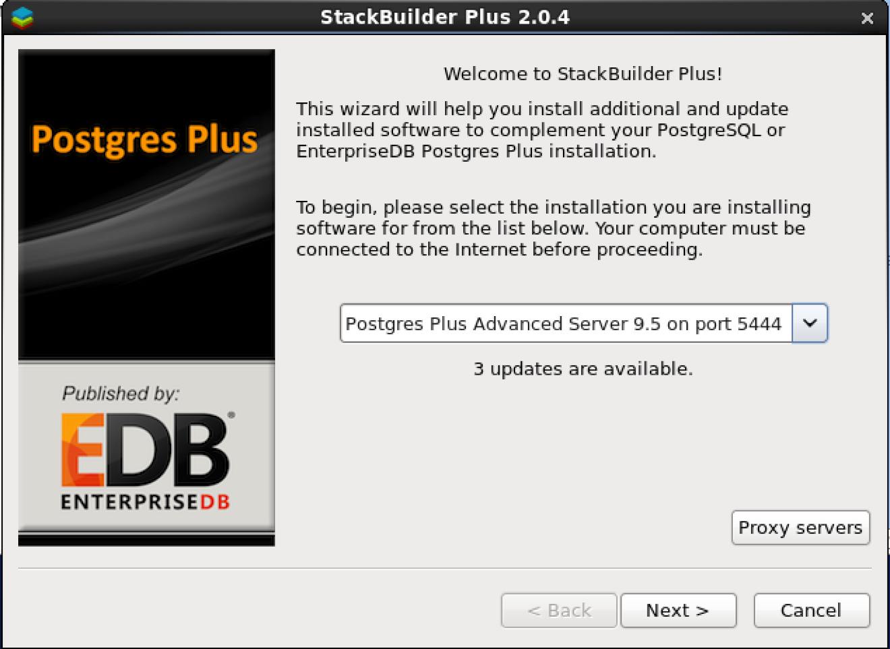
> 여러 버전의 EDB PAS가 설치되어 있는 경우 패치를 하고자 하는 버전을 정확히 선택하여 패치 다운로드 과정을 진행
2. 패치 항목 선택
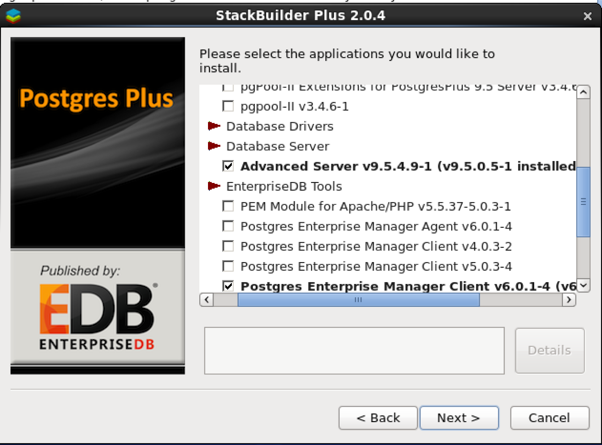
3. EDB에 로그인
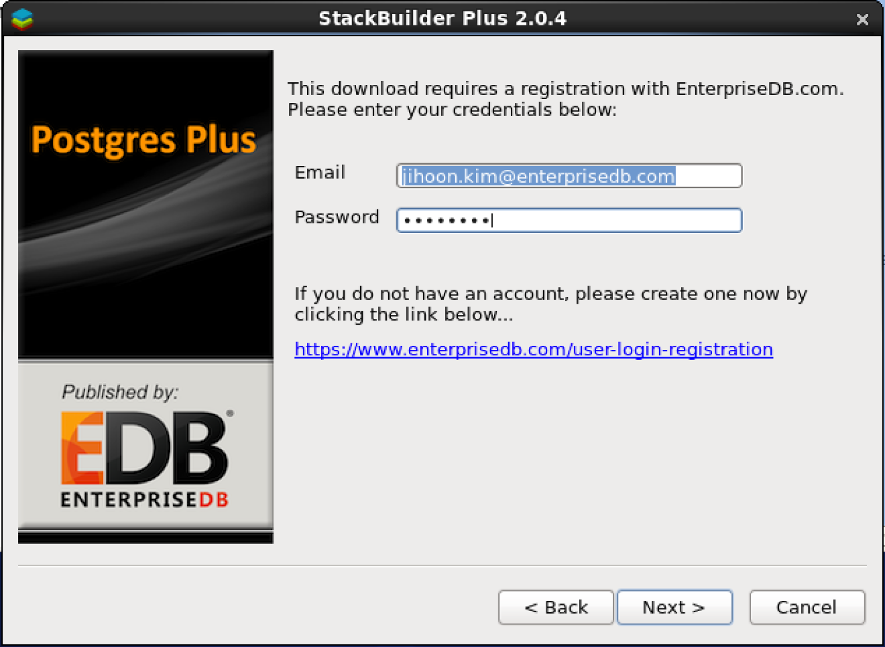
 > EDB 웹사이트 계정으로 로그인
4. 패치 항목 선택 확인 및 다운로드 경로 지정
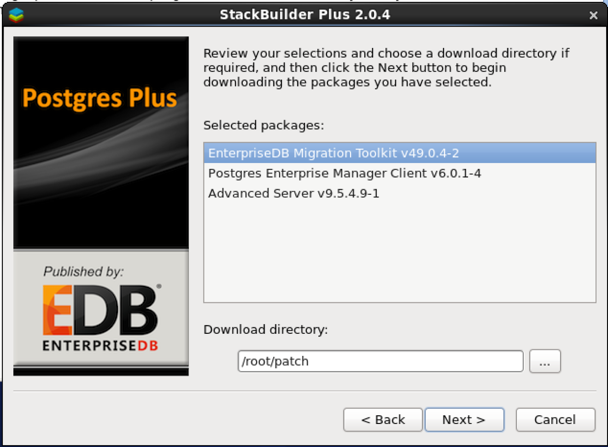
5. 다운로드 중
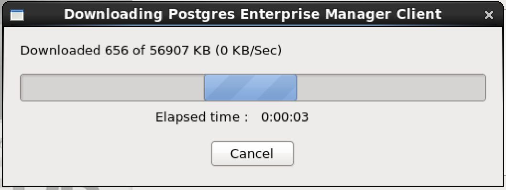
6. 다운로드 확인
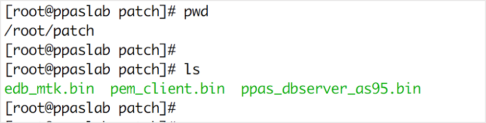
> **주의사항!**
> 다운로드 파일에 패치 버전이 포함되어 있지 않기 때문에 스택빌더를 통한 자동 설치가 아닌 관리자에 의한 수동 설치 진행 시, 파일의 네이밍을 별도로 관리해 주거나 또는 날짜 등을 잘 확인하여 설치해야함
7. 패치 설치
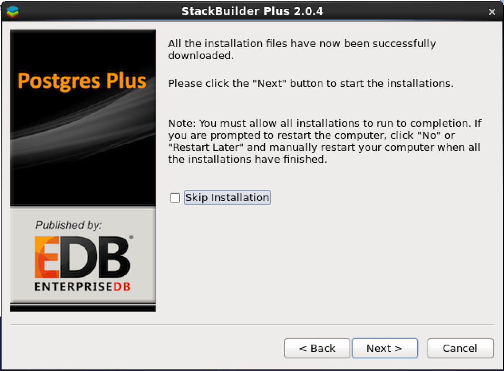
> `Skip Installation` 버튼을 체크하면 관리자가 수동 설치하겠다는 의미로 자동 패치 설치 단계가 스킵되고 Stackbuilder Plus는 종료됨
> 패치 설치 과정은 PAS 설치와 동일하게 진행됨


## 3. Customer Portal
Stackbuilder Plus를 통한 설치가 어려운 환경에서 사용할 수 있는 방법으로 EDB 웹사이트를 통한 최신 패치 파일을 다운받아 패치를 적용할 수 있음
> **주의사항!**
> Customer Portal을 사용하기 위해서는 Stackbuilder Plus와 다르게 추가적인 권한 설정이 필요함
> 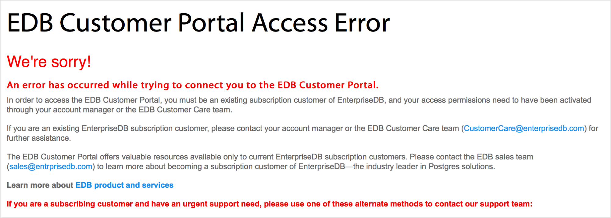
> mailto:sales-kr@enterprisedb.com 으로 `Customer Portal 상요 권한 요청` 제목으로 문의 요망!
> 본 문서는 Customer Portal 사용 권한이 있다는 것을 가정하고 작성됨

1. Customer Portal Login
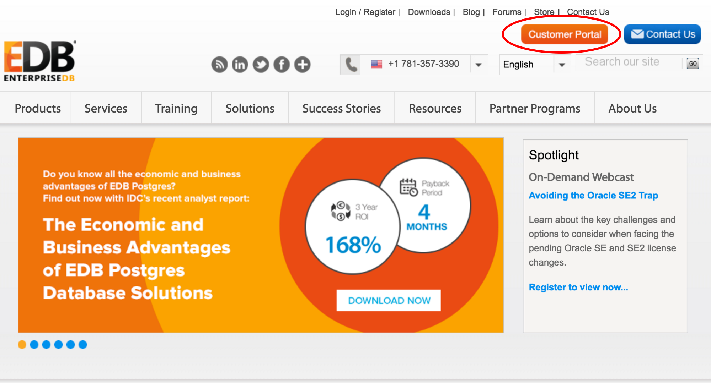
> EDB 웹사이트 상단 우측의 `Customer Portal` 이미지를 클릭하면 새창이 열림

2. Customer Portal 홈 화면
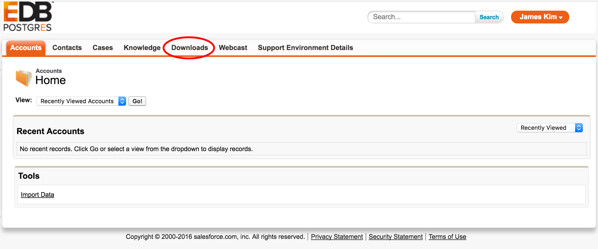
> `Download` 탭 메뉴를 선택하여 패치 다운도르 화면으로 이동
3. 패치 다운로드 페이지 화면
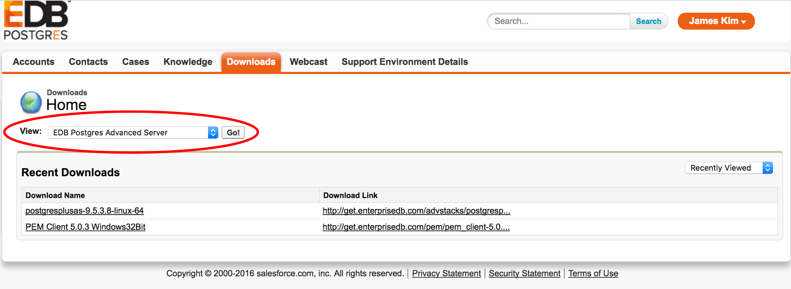
> `View` 드롭다운 메뉴에서 다운받을 컴포넌트 선택
4. View 드롭다운 메뉴 상세 화면
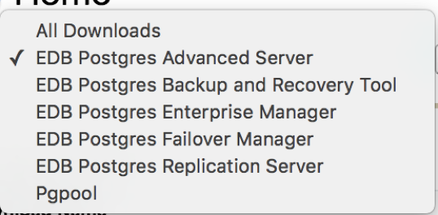
5. 컴포넌트 패치 파일 목록 화면
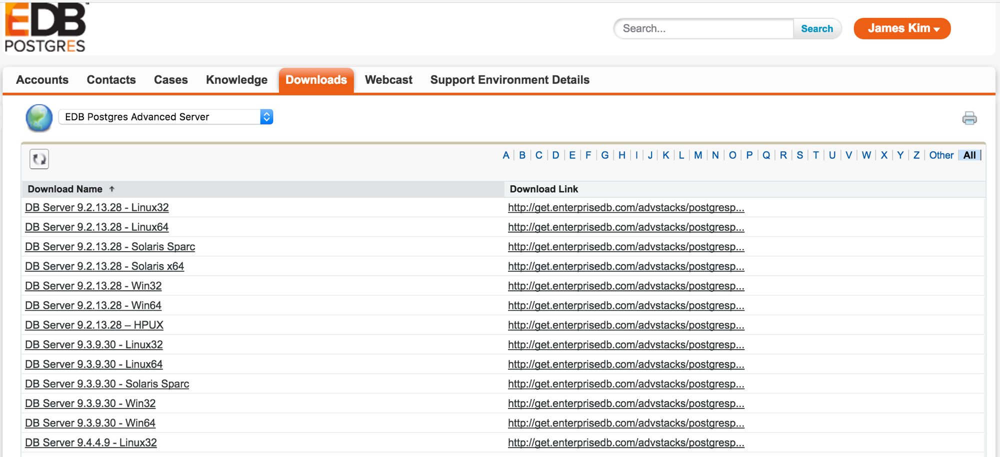
> 패치 파일 네이밍 컨벤션이 통일이 되어 있지 않아 최신 파일을 찾는데 불편함이 있음
> 약간의 인내심이 필요하지만 적절한 검색 스킬을 동원하면 찾을 수 있음
6. 패치 파일 선택 화면
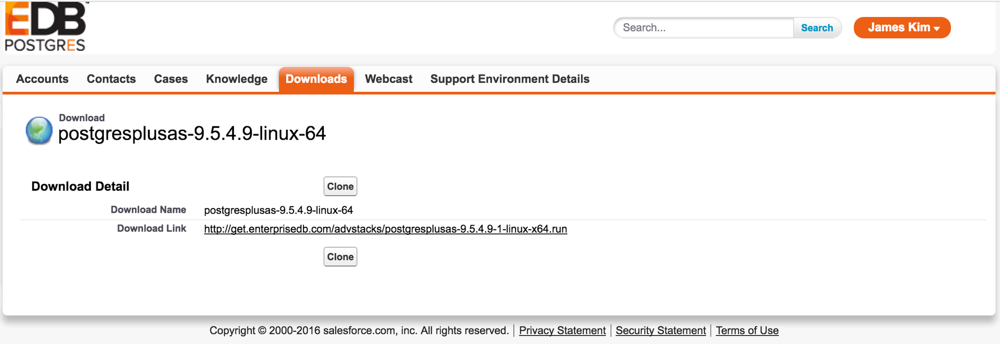
> 링크를 클릭하여 패치 파일 다운로드
7. 이후 설치 과정은 동일