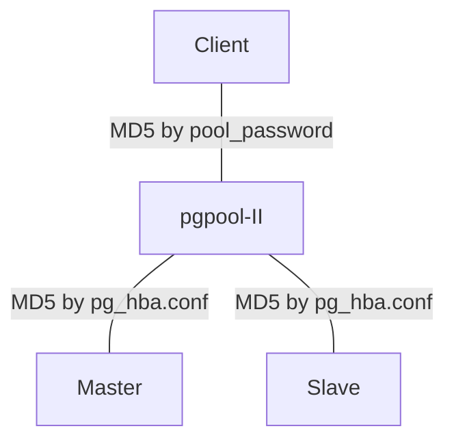

# Lab: pgpool-II

## 사전 준비

* 설정 값 검토

  pgpool-II는 상당히 많은 설정 값들이 존제하기 때문에 여기서 각각의 의미를 모두 살펴 보기는 힘들다. 아래 메뉴얼을 훓어 보고 대략적인 내용을 확인해 보자.

  > http://www.pgpool.net/docs/latest/pgpool-en.html

* Host name 설정

  일반적인 pgpool-II 구성에서는 여러대의 host가 사용되지만 지금은 테스트이기 때문에 앞서 구성해 둔 2개의 클러스터를 이용해 구성해 보도록 한다. 
  장비의 IP에 맞게 `/etc/hosts` 파일을 수정한다.

  ```
  [enterprisedb@ppaslab ~]$ ifconfig
  eth4      Link encap:Ethernet  HWaddr 08:00:27:FE:3E:0A  
            inet addr:10.0.2.15  Bcast:10.0.2.255  Mask:255.255.255.0
            inet6 addr: fe80::a00:27ff:fefe:3e0a/64 Scope:Link
            UP BROADCAST RUNNING MULTICAST  MTU:1500  Metric:1
            RX packets:860 errors:0 dropped:0 overruns:0 frame:0
            TX packets:1637 errors:0 dropped:0 overruns:0 carrier:0
            collisions:0 txqueuelen:1000 
            RX bytes:156564 (152.8 KiB)  TX bytes:124492 (121.5 KiB)

  eth5      Link encap:Ethernet  HWaddr 08:00:27:D7:15:12  
            inet addr:192.168.56.101  Bcast:192.168.56.255  Mask:255.255.255.0
            inet6 addr: fe80::a00:27ff:fed7:1512/64 Scope:Link
            UP BROADCAST RUNNING MULTICAST  MTU:1500  Metric:1
            RX packets:42367 errors:0 dropped:0 overruns:0 frame:0
            TX packets:32398 errors:0 dropped:0 overruns:0 carrier:0
            collisions:0 txqueuelen:1000 
            RX bytes:3881672 (3.7 MiB)  TX bytes:5037457 (4.8 MiB)

  lo        Link encap:Local Loopback  
            inet addr:127.0.0.1  Mask:255.0.0.0
            inet6 addr: ::1/128 Scope:Host
            UP LOOPBACK RUNNING  MTU:65536  Metric:1
            RX packets:479867 errors:0 dropped:0 overruns:0 frame:0
            TX packets:479867 errors:0 dropped:0 overruns:0 carrier:0
            collisions:0 txqueuelen:0 
            RX bytes:1115333715 (1.0 GiB)  TX bytes:1115333715 (1.0 GiB)
  [enterprisedb@ppaslab ~]$ grep ppaslab /etc/hosts
  192.168.56.101	ppaslab
  ```

* Password less ssh 설정

  노드간의 password less ssh 접속이 가능해야 한다. 실제 환경이라면 모든 노드간에 public key를 교환해 줘야 한다.

  ```
  [enterprisedb@ppaslab ~]$ ssh-keygen 
  Generating public/private rsa key pair.
  Enter file in which to save the key (/opt/PostgresPlus/9.5AS/.ssh/id_rsa): 
  Created directory '/opt/PostgresPlus/9.5AS/.ssh'.
  Enter passphrase (empty for no passphrase): 
  Enter same passphrase again: 
  Your identification has been saved in /opt/PostgresPlus/9.5AS/.ssh/id_rsa.
  Your public key has been saved in /opt/PostgresPlus/9.5AS/.ssh/id_rsa.pub.
  The key fingerprint is:
  db:e6:a0:b6:a0:54:bb:91:b9:04:29:9e:ad:f6:58:c0 enterprisedb@ppaslab
  The key's randomart image is:
  +--[ RSA 2048]----+
  |                 |
  |                 |
  |                 |
  |.  .             |
  |.Eo .   S        |
  |..+o +   o       |
  | o.oB   o o      |
  | o+o =.. +       |
  |.oo.o.o.  .      |
  +-----------------+
  [enterprisedb@ppaslab ~]$ cat .ssh/id_rsa.pub >> .ssh/authorized_keys
  [enterprisedb@ppaslab ~]$ chmod 600 .ssh/authorized_keys
  [enterprisedb@ppaslab ~]$ ssh ppaslab
  Last login: Sat Feb 13 17:12:40 2016 from ppaslab
  [enterprisedb@ppaslab ~]$ exit
  logout
  Connection to ppaslab closed.
  ```

* PATH 설정

  `pgplus_env.sh` 파일을 열어 아래 내용을 추가해 준다.

  ```
  export PGPOOL_HOME=/opt/PostgresPlus/pgpool-II-3.4
  export PATH=$PATH:$PGPOOL_HOME/bin
  ```

  아래와 같이 `pgplus_env.sh`의 내용을 다시 적용한다.

  ```
  [enterprisedb@ppaslab ~]$ . pgplus_env.sh 
  ```

* 서비스 disable

  pgpool이 설치 되면서 서비스에 등록되어 자동으로 기동되어 있다. 실습을 진행하기 전에 먼저 이를 중지 시키고 비활성화 시키자. root계정에서 실행

  ```
  [root@ppaslab ~]# chkconfig ppas-pgpool-3.4 off
  [root@ppaslab ~]# service ppas-pgpool-3.4 stop
  INFO: [PID: 2649]
  INFO: [CMD:]

  Stopping ppas-pgpool-3.4                                   [  OK  ]

  MSG:  [ppas-pgpool-3.4 stopped]

  INFO: [Please see service script file /var/log/ppas-pgpool-3.4/ppas-pgpool-3.4_script.log for details]
  ```

## 설정

### `pcp.conf`

* pgpool의 상태를 관리하기 위한 pcp 설정

  pcp에서 사용할 ID와 패스워드를 설정해야 한다. `pg_md5` 유틸리티를 이용해서 패스워드를 생성해 보자. 여기에서는 패스워드로 `ppas`를 사용하였다.
  ```
  [enterprisedb@ppaslab ~]$ pg_md5 ppas
  504389a48ef4d3236c1e2437b8347055
  ```

  생성된 문자열을 이용해서 아래와 같이 `pcp.conf` 파일을 생성한다.

  ```
  [enterprisedb@ppaslab ~]$ cd /opt/PostgresPlus/pgpool-II-3.4/etc
  [enterprisedb@ppaslab etc]$ echo enterprisedb:504389a48ef4d3236c1e2437b8347055 >> pcp.conf
  ```

### `pgpool.conf`

* Sample file 복사
  ```
  [enterprisedb@ppaslab etc]$ cp pgpool.conf.sample-stream  pgpool.conf
  ```

* 설정 변경

  아래 설정을 찹고하여 `pgpool.conf` 파일을 변경 해 준다.
  ```
  listen_addresses = '*'
  port = 9999

  # Backend 접속 설정
  backend_hostname0 = 'ppaslab'
  backend_port0 = 5444
  backend_weight0 = 1
  backend_data_directory0 = '/opt/PostgresPlus/9.5AS/data'
  backend_flag0 = 'ALLOW_TO_FAILOVER'
  backend_hostname1 = 'ppaslab'
  backend_port1 = 5446
  backend_weight1 = 1
  backend_data_directory1 = '/opt/PostgresPlus/9.5AS/data5446'
  backend_flag1 = 'ALLOW_TO_FAILOVER'

  # pool_hba.conf를 통한 인증 설정 (필수)
  enable_pool_hba = on

  pid_file_name = '/opt/PostgresPlus/pgpool-II-3.4/pgpool.pid'

  sr_check_user = 'replcheck'
  sr_check_password = 'replcheck'

  # pool 설정
  num_init_children = 5
  max_pool = 1
  connection_cache = off
  ```

* Replication 상태 check를 위한 user를 생성한다.
  ```
  edb=# create user replcheck password 'replcheck';
  CREATE ROLE
  ```

### 인증 설정

pgpool은 PG/PPAS의 앞단에서 접속을 처리하기 때문에 독자적인 인증 설정이 필요하다.
대부분의 경우 아래와 같은 구성이 사용되게 된다.



Client가 pgpool-II에 접속하게 되면 `pool_hba.conf`를 통해 인증 방식을 결정하게 되는데 backend DB의 `pg_hba.conf`와의 조합에 따라 다양한 결과가 나타나게 된다. 권장되는 조합은 다음과 같다.

* pgpool의 `pool_hba.conf`
  예상 되는 client의 접속에 대해 `md5` 인증 설정

  ```
  # "local" is for Unix domain socket connections only
  local   all         all                               md5
  # IPv4 local connections:
  host    all         all         127.0.0.1/32          md5
  host    all         all         192.168.56.101/32     md5
  # IPv6 local connections:
  host    all         all         ::1/128               md5
  ```
* DB들의 `pg_hba.conf`

  아래와 같이 pgpool로 부터의 접속을 md5 인증으로 허용해 준다.(Master, Slave 모두)
  ```
  host    all             all             192.168.56.101/32       md5
  ```

  설정을 reload 한다.

  ```
  [enterprisedb@ppaslab ~]$ pg_ctl -D data reload
  server signaled
  [enterprisedb@ppaslab ~]$ pg_ctl -D data5446 reload
  server signaled
  ```

이렇게 설정을 하게 되면 접속 하고자 하는 계정을 `pool_passwd` 파일에 등록하여야 한다.

* `pool_passwd` 설정

  `pg_md5`를 이용하여 생성할 수 있는데 이때 주의해야 할 점은 **반드시 backend DB의 패스워드와 동일한 패스워드를 사용해야 한다**는 점이다. 이는 이 파일을 통해 pgpool의 인증을 통과한 다음 다시 backend DB에서 인증을 하기 때문이다.

  ```
  [enterprisedb@ppaslab ~]$ cd $PGPOOL_HOME/etc
  [enterprisedb@ppaslab etc]$ pg_md5 -m -p -f pgpool.conf -u enterprisedb 
  password: 
  [enterprisedb@ppaslab etc]$ cat pool_passwd 
  enterprisedb:md5d82ed0cb39b80dc5a252bc7057785501
  ```

## 기동

* Foreground 모드
  테스트등의 용도로 기동할 때는 아래와 같이 non-daemon mode가 유용하다.
  ```
  [enterprisedb@ppaslab ~]$ cd $PGPOOL_HOME/etc
  [enterprisedb@ppaslab bin]$ pgpool -f pgpool.conf -a pool_hba.conf -F pcp.conf -n
  ```

  이렇게 기동하였다면 `Ctrl+C`를 통해 종료할 수 있다.

* Daemon 모드
  nohup 등을 이용하여 background 모드로 실행할 수 있다.
  ```
  [enterprisedb@ppaslab etc]$ pgpool -f pgpool.conf -a pool_hba.conf -F pcp.conf -n &
  ```

  이 경우 아래와 같은 명령어로 종료가 가능하다.

  ```
  [enterprisedb@ppaslab etc]$ pgpool -f pgpool.conf -a pool_hba.conf -F pcp.conf --mode immediate stop
  ```

## 테스트

### 정보 확인

* `SHOW` commands
  ```
  [enterprisedb@ppaslab bin]$ psql -p 9999
  Password: 
  psql.bin (9.5.0.5)
  Type "help" for help.

  edb=# show pool_version;  
      pool_version     
  ---------------------
   3.4.3 (tataraboshi)
  (1 row)

  edb=# show pool_nodes;
   node_id | hostname | port | status | lb_weight |  role   
  ---------+----------+------+--------+-----------+---------
   0       | ppaslab  | 5444 | 2      | 0.500000  | primary
   1       | ppaslab  | 5446 | 2      | 0.500000  | standby
  (2 rows)

  edb=# show pool_processes;
   pool_pid |     start_time      | database |   username   |     create_time     | pool_counter 
  ----------+---------------------+----------+--------------+---------------------+--------------
   11083    | 2016-02-13 20:25:31 | edb      | enterprisedb | 2016-02-13 20:25:34 | 1
   11084    | 2016-02-13 20:25:31 |          |              |                     | 
   11085    | 2016-02-13 20:25:31 |          |              |                     | 
   11086    | 2016-02-13 20:25:31 |          |              |                     | 
   11087    | 2016-02-13 20:25:31 |          |              |                     | 
  (5 rows)

  edb=# show pool_pools;
   pool_pid |     start_time      | pool_id | backend_id | database |   username   |     create_time     | majorversion | minorversion | pool_counter | pool_backendpid | pool_connected 
  ----------+---------------------+---------+------------+----------+--------------+---------------------+--------------+--------------+--------------+-----------------+----------------
   11083    | 2016-02-13 20:25:31 | 0       | 0          | edb      | enterprisedb | 2016-02-13 20:25:34 | 3            | 0            | 1            | 11107           | 1
   11083    | 2016-02-13 20:25:31 | 0       | 1          | edb      | enterprisedb | 2016-02-13 20:25:34 | 3            | 0            | 1            | 11106           | 1
   11084    | 2016-02-13 20:25:31 | 0       | 0          |          |              |                     | 0            | 0            | 0            | 0               | 0
   11084    | 2016-02-13 20:25:31 | 0       | 1          |          |              |                     | 0            | 0            | 0            | 0               | 0
   11085    | 2016-02-13 20:25:31 | 0       | 0          |          |              |                     | 0            | 0            | 0            | 0               | 0
   11085    | 2016-02-13 20:25:31 | 0       | 1          |          |              |                     | 0            | 0            | 0            | 0               | 0
   11086    | 2016-02-13 20:25:31 | 0       | 0          |          |              |                     | 0            | 0            | 0            | 0               | 0
   11086    | 2016-02-13 20:25:31 | 0       | 1          |          |              |                     | 0            | 0            | 0            | 0               | 0
   11087    | 2016-02-13 20:25:31 | 0       | 0          |          |              |                     | 0            | 0            | 0            | 0               | 0
   11087    | 2016-02-13 20:25:31 | 0       | 1          |          |              |                     | 0            | 0            | 0            | 0               | 0
  (10 rows)
  ```

* 별도의 세션을 열고 쿼리를 실행해 보면
  ```
  [enterprisedb@ppaslab ~]$ psql -p 9999
  Password: 
  psql.bin (9.5.0.5)
  Type "help" for help.

  edb=# select count(*) from test;
   count 
  -------
    2000
  (1 row)

  edb=# 
  ```

  다음과 같이 이 세션이 새로운 pool process에 할당 되었음을 확인할 수 있다.

  ```
  edb=# show pool_pools;
   pool_pid |     start_time      | pool_id | backend_id | database |   username   |     create_time     | majorversion | minorversion | pool_counter | pool_backendpid | pool_connected 
  ----------+---------------------+---------+------------+----------+--------------+---------------------+--------------+--------------+--------------+-----------------+----------------
   11083    | 2016-02-13 20:25:31 | 0       | 0          | edb      | enterprisedb | 2016-02-13 20:25:34 | 3            | 0            | 1            | 11107           | 1
   11083    | 2016-02-13 20:25:31 | 0       | 1          | edb      | enterprisedb | 2016-02-13 20:25:34 | 3            | 0            | 1            | 11106           | 1
   11084    | 2016-02-13 20:25:31 | 0       | 0          | edb      | enterprisedb | 2016-02-13 20:26:30 | 3            | 0            | 1            | 11199           | 1
   11084    | 2016-02-13 20:25:31 | 0       | 1          | edb      | enterprisedb | 2016-02-13 20:26:30 | 3            | 0            | 1            | 11198           | 1
   11085    | 2016-02-13 20:25:31 | 0       | 0          |          |              |                     | 0            | 0            | 0            | 0               | 0
   11085    | 2016-02-13 20:25:31 | 0       | 1          |          |              |                     | 0            | 0            | 0            | 0               | 0
   11086    | 2016-02-13 20:25:31 | 0       | 0          |          |              |                     | 0            | 0            | 0            | 0               | 0
   11086    | 2016-02-13 20:25:31 | 0       | 1          |          |              |                     | 0            | 0            | 0            | 0               | 0
   11087    | 2016-02-13 20:25:31 | 0       | 0          |          |              |                     | 0            | 0            | 0            | 0               | 0
   11087    | 2016-02-13 20:25:31 | 0       | 1          |          |              |                     | 0            | 0            | 0            | 0               | 0
  (10 rows)
  ```

### pgbench
앞서 생성해 둔 pgbench DB에 부하를 발생 시키고 2대의 node에 부하가 분산되는지 확인해 보자.

* Select only test

  ```
  pgbench -c 4 -S -s 100 -T 120 -p 9999 -U enterprisedb pgbench
  ```

  ```
  [enterprisedb@ppaslab ~]$ psql -p 5444 -c 'select query from pg_stat_activity where state <> 'idle';'
                             query                            
  ------------------------------------------------------------
   SELECT abalance FROM pgbench_accounts WHERE aid = 710835;
   SELECT abalance FROM pgbench_accounts WHERE aid = 5473587;
   select query from pg_stat_activity where state <> 'idle';
  (3 rows)

  [enterprisedb@ppaslab ~]$ psql -p 5444 -c 'select query from pg_stat_activity where state <> 'idle';'
                             query                            
  ------------------------------------------------------------
   SELECT abalance FROM pgbench_accounts WHERE aid = 176652;
   SELECT abalance FROM pgbench_accounts WHERE aid = 4677660;
   select query from pg_stat_activity where state <> 'idle';
  (3 rows)

  [enterprisedb@ppaslab ~]$ psql -p 5446 -c 'select query from pg_stat_activity where state <> 'idle';'
                             query                            
  ------------------------------------------------------------
   SELECT abalance FROM pgbench_accounts WHERE aid = 3372445;
   select query from pg_stat_activity where state <> 'idle';
  (2 rows)

  [enterprisedb@ppaslab ~]$ psql -p 5446 -c "select query from pg_stat_activity where state <> 'idle';"
                             query                            
  ------------------------------------------------------------
   SELECT abalance FROM pgbench_accounts WHERE aid = 2670098;
   SELECT abalance FROM pgbench_accounts WHERE aid = 4638834;
   select query from pg_stat_activity where state <> 'idle';
  (3 rows)
  ```

* TPC-B
  `-S` 옵션을 빼면 DML 쿼리도 같이 실행된다. DML이 master에서 select가 slave에서 정상 수행 되는지 확인해 보자.
  단, 이 테스트 자체가 DML의 비중이 매우 높아서 slave에서 실행되는 select의 비율이 매우 낮을 수 있음을 유의하자.

  ```
  [enterprisedb@ppaslab ~]$ pgbench -c 4 -s 100 -T 120 -p 9999 -U enterprisedb pgbench
  ```

  ```
  [enterprisedb@ppaslab ~]$ psql -p 5444 -c "select query from pg_stat_activity where state <> 'idle';"
                                   query                                  
  ------------------------------------------------------------------------
   UPDATE pgbench_branches SET bbalance = bbalance + -453 WHERE bid = 31;
   END;
   END;
   END;
   select query from pg_stat_activity where state <> 'idle';
  (5 rows)

  [enterprisedb@ppaslab ~]$ psql -p 5444 -c "select query from pg_stat_activity where state <> 'idle';"
                                      query                                     
  ------------------------------------------------------------------------------
   UPDATE pgbench_accounts SET abalance = abalance + -323 WHERE aid = 4925417;
   UPDATE pgbench_accounts SET abalance = abalance + -2232 WHERE aid = 3811086;
   END;
   END;
   select query from pg_stat_activity where state <> 'idle';
  (5 rows)

  [enterprisedb@ppaslab ~]$ psql -p 5446 -c "select query from pg_stat_activity where state <> 'idle';"
  Password: 
                             query                           
  -----------------------------------------------------------
   select query from pg_stat_activity where state <> 'idle';
  (1 row)

  [enterprisedb@ppaslab ~]$ psql -p 5446 -c "select query from pg_stat_activity where state <> 'idle';"
  Password: 
                             query                           
  -----------------------------------------------------------
   BEGIN;
   select query from pg_stat_activity where state <> 'idle';
  (2 rows)
  ```