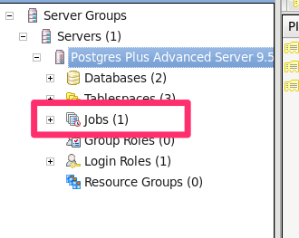
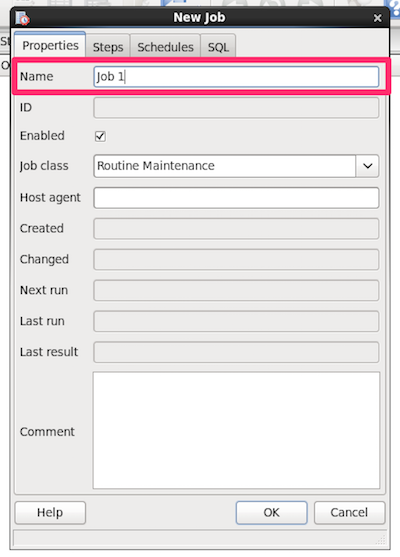
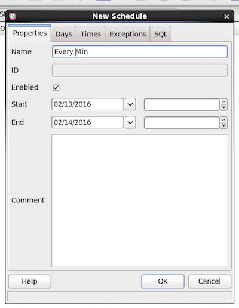
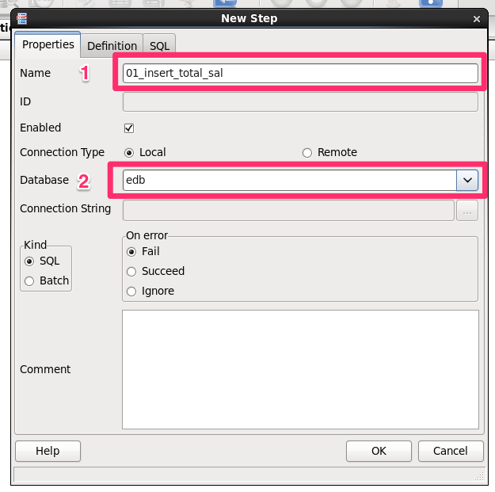
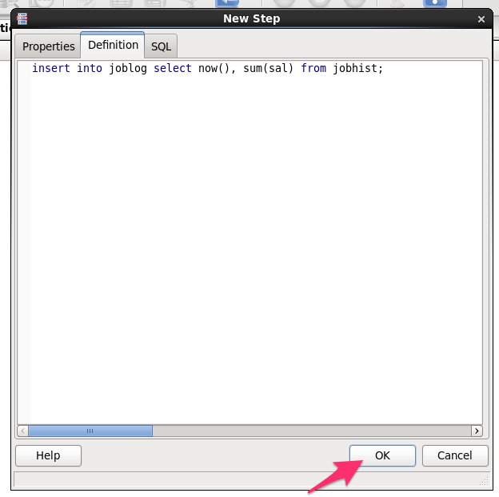
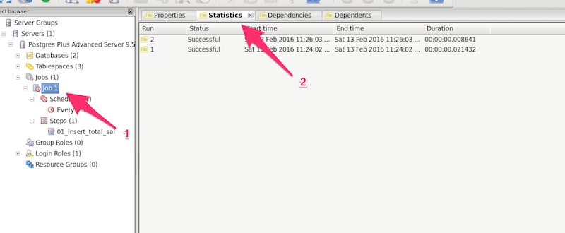
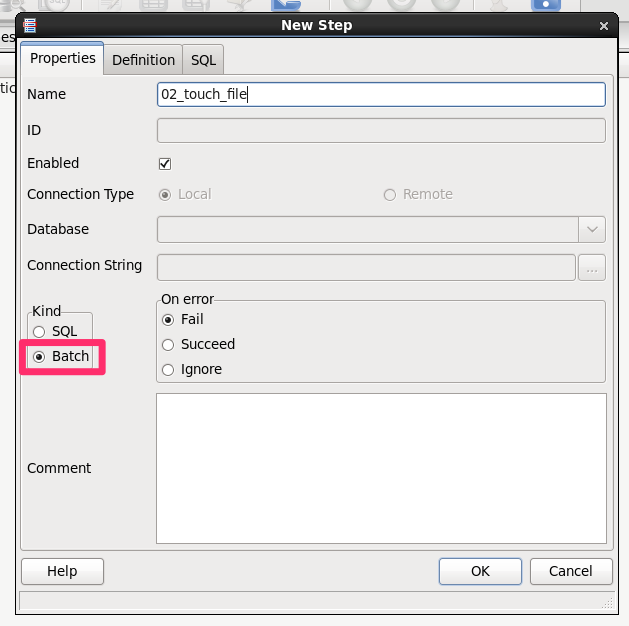
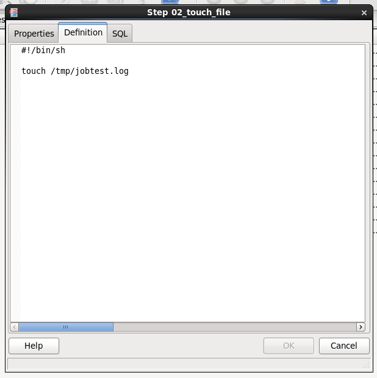

# Lab. Scheduler

## 준비

### pg_agent

pgAdmin 및 PEM client는 간단한 job scheduler 기능을 제공한다. 이 기능은 pg_agent를 통해 작업을 수행하기 때문에 pg_agent가 실행되어 있어야 한다.

아래 명령으로 실행 상태를 확인한다.
```
[root@ppaslab ~]# /etc/init.d/ppas-agent-9.5 status
INFO: [PID: 4801]
INFO: [CMD: /opt/PostgresPlus/9.5AS/bin/pgagent -l 1 -s /var/log/ppas-agent-9.5/ppas-agent-9.5.log hostaddr=localhost port=5444 dbname=edb user=enterprisedb]
MSG:  [ppas-agent-9.5 is running]
INFO: [Please see service script file /var/log/ppas-agent-9.5/ppas-agent-9.5_script.log for details]
```

만약 실행중이 아니라면 아래와 같이 실행할 수 있다.

```
[root@ppaslab ~]# /etc/init.d/ppas-agent-9.5 start
Starting ppas-agent-9.5                                    [  OK  ]

INFO: [PID: 4801]
INFO: [CMD: /opt/PostgresPlus/9.5AS/bin/pgagent -l 1 -s /var/log/ppas-agent-9.5/ppas-agent-9.5.log hostaddr=localhost port=5444 dbname=edb user=enterprisedb]
MSG:  [ppas-agent-9.5 started]

INFO: [Please see service script file /var/log/ppas-agent-9.5/ppas-agent-9.5_script.log for details]
```

아래와 같은 메시지가 표시된다면 `pg_agen`가 죽어있는 것이다.

```
[root@ppaslab ~]# /etc/init.d/ppas-agent-9.5 status
INFO: [ppas-agent-9.5 dead but pid file "/var/run/ppas-agent-9.5/ppas-agent-9.5.pid" exists. Please delete this file manually]

INFO: [Total 1 errors encountered]
INFO: [Please see application log file /var/log/ppas-agent-9.5/ppas-agent-9.5.log for details]
INFO: [Please see service script file /var/log/ppas-agent-9.5/ppas-agent-9.5_script.log for details]
```

원인은 `pg_agent`가 접속한 DB가 재기동 된것이다. 이는 `pg_agent` 자체의 문제로 향후 개선 될 것으로 기대한다. 아래와 같이 pid 파일을 삭제한 다음 다시 기동시켜 주면 된다.

```
[root@ppaslab ~]# rm -f /var/run/ppas-agent-9.5/ppas-agent-9.5.pid
[root@ppaslab ~]# /etc/init.d/ppas-agent-9.5 status
MSG:  [ppas-agent-9.5 is not running]

INFO: [Please see service script file /var/log/ppas-agent-9.5/ppas-agent-9.5_script.log for details]

[root@ppaslab ~]# /etc/init.d/ppas-agent-9.5 start
Starting ppas-agent-9.5                                    [  OK  ]

INFO: [PID: 8630]
INFO: [CMD: /opt/PostgresPlus/9.5AS/bin/pgagent -l 1 -s /var/log/ppas-agent-9.5/ppas-agent-9.5.log hostaddr=localhost port=5444 dbname=edb user=enterprisedb]
MSG:  [ppas-agent-9.5 started]

INFO: [Please see service script file /var/log/ppas-agent-9.5/ppas-agent-9.5_script.log for details]

```

### 테이블 준비

```
edb=# create table joblog (ts timestamp, total_sal numeric(7,2));
CREATE TABLE
```

## PEM 실행

GUI상에서 PEM client를 실행하고 로컬 서버로 접속한다. 접속이 되면 아래와 같이 Jobs 항목을 볼 수 있다.



## 작업 생성

### Job 생성

PEM에서 Job은 단순히 group 역할만 한다. 따라서 생성 또한 간단하다. 서버 트리의 `Jobs`를 Right-Click 한 다음 `New Job`을 선택한다.
아래 창이 나타나면 이름만 입력하면 된다.



### Schedule 생성

생성된 job `Job 1`을 열고 하위의 `Schedules`를 Right-Click 한 다음 `New Schedule`를 클릭하면 아래와 같은 창이 뜬다.



이름과 시작 시간 종료시간을 입력하자. `Days`, `Times` 등의 tab에서는 실행된 일시를 설정할 수 있는데 기본 상태로 두면 1분마다 실행 된다. 지금은 그냥 1분마다 실행되도록 두고 `OK`를 누른다.

### Step 생성

`Steps`를 Right-Click 한 뒤 `New Step`을 클릭하여 아래 창을 띄우자.
아래와 같이 이름을 입력하고 대상 DB를 선택한다.



다음으로 `Definition` 텝을 클릭하고 아래 이미지와 같이 쿼리를 입력해 준다.

```
insert into joblog select now(), sum(sal) from jobhist;
```


### 실행 결과 모니터링

이제 잠시 기다리면 아래와 같이 실행된 결과가 표시된다. 1분에 한번씩 실행이 되는지 확인해 보자.



아래와 같이 쿼리를 통해서도 데이터가 잘 들어오고 있는지 확인해 보자.

```
edb=# select * from joblog;
            ts             | total_sal 
---------------------------+-----------
 13-FEB-16 23:24:02.982664 |  32015.00
 13-FEB-16 23:26:03.055013 |  32015.00
(2 rows)

```

### Batch type step 생성

추가로 step을 하나 더 생성해 보자. 이번에는 `Kind`를 `Batch`로 선택해 보자. Database 선택 등이 비활성화 된 것을 볼 수 있다.



이제 `Definition` 텝을 열고 아래와 같이 shell script를 입력해 보자.

```
#!/bin/sh

touch /tmp/jobtest.log
```



잠시 후 배치가 실행되고 `/tmp/jobtest.log` 파일이 생성되는지 확인해 보자.

```
[enterprisedb@ppaslab tmp]$ ls -l jobtest.log
ls: cannot access jobtest.log: No such file or directory
[enterprisedb@ppaslab tmp]$ ls -l jobtest.log
ls: cannot access jobtest.log: No such file or directory
[enterprisedb@ppaslab tmp]$ ls -l jobtest.log
-rw-r--r--. 1 enterprisedb enterprisedb 0 Feb 14 00:44 jobtest.log
```