# Lab: User Tools Hands-on Lab

## 1. psql
#### 1.1. psql Options
```
-bash-4.1$ psql --help
edb-psql 9.5.0.5 is the EnterpriseDB interactive terminal.

Usage:
  edb-psql [OPTION]... [DBNAME [USERNAME]]

General options:
  -c, --command=COMMAND    run only single command (SQL or internal) and exit
  -d, --dbname=DBNAME      database name to connect to (default: "edb")
  -f, --file=FILENAME      execute commands from file, then exit
  -l, --list               list available databases, then exit
  -v, --set=, --variable=NAME=VALUE
                           set psql variable NAME to VALUE
                           (e.g., -v ON_ERROR_STOP=1)
  -V, --version            output version information, then exit
  -X, --no-psqlrc          do not read startup file (~/.psqlrc)
  -1 ("one"), --single-transaction
                           execute as a single transaction (if non-interactive)
  -?, --help[=options]     show this help, then exit
      --help=commands      list backslash commands, then exit
      --help=variables     list special variables, then exit

Input and output options:
  -a, --echo-all           echo all input from script
  -b, --echo-errors        echo failed commands
  -e, --echo-queries       echo commands sent to server
  -E, --echo-hidden        display queries that internal commands generate
  -L, --log-file=FILENAME  send session log to file
  -n, --no-readline        disable enhanced command line editing (readline)
  -o, --output=FILENAME    send query results to file (or |pipe)
  -q, --quiet              run quietly (no messages, only query output)
  -s, --single-step        single-step mode (confirm each query)
  -S, --single-line        single-line mode (end of line terminates SQL command)

Output format options:
  -A, --no-align           unaligned table output mode
  -F, --field-separator=STRING
                           field separator for unaligned output (default: "|")
  -H, --html               HTML table output mode
  -P, --pset=VAR[=ARG]     set printing option VAR to ARG (see \pset command)
  -R, --record-separator=STRING
                           record separator for unaligned output (default: newline)
  -t, --tuples-only        print rows only
  -T, --table-attr=TEXT    set HTML table tag attributes (e.g., width, border)
  -x, --expanded           turn on expanded table output
  -z, --field-separator-zero
                           set field separator for unaligned output to zero byte
  -0, --record-separator-zero
                           set record separator for unaligned output to zero byte

Connection options:
  -h, --host=HOSTNAME      database server host or socket directory (default: "local socket")
  -p, --port=PORT          database server port (default: "5444")
  -U, --username=USERNAME  database user name (default: "enterprisedb")
  -w, --no-password        never prompt for password
  -W, --password           force password prompt (should happen automatically)

For more information, type "\?" (for internal commands) or "\help" (for SQL
commands) from within edb-psql, or consult the psql section in the EnterpriseDB
documentation.

Report bugs to <support@enterprisedb.com>.
-bash-4.1$
```
#### 1.2. Connect
##### 1.2.1. psql 이용하여 enterprisedb 유저로 localhost의 edb 데이터베이스에 접속
```sql
-bash-4.1$ psql -h localhost -d edb -U enterprisedb
psql.bin (9.5.0.5)
Type "help" for help.

edb=#
```
##### 1.2.2. Switching Databases
```sql
edb=#
edb=# \c postgres enterprisedb
You are now connected to database "postgres" as user "enterprisedb".
postgres=#
postgres=# \c edb enterprisedb
You are now connected to database "edb" as user "enterprisedb".
edb=#
```

#### 1.3. Information Commands
##### 1.3.1. List tables & describe dept table
```sql
edb=# \dt
            List of relations
 Schema |  Name   | Type  |    Owner
--------+---------+-------+--------------
 public | dept    | table | enterprisedb
 public | emp     | table | enterprisedb
 public | jobhist | table | enterprisedb
(3 rows)

edb=#
edb=# \dt+
                         List of relations
 Schema |  Name   | Type  |    Owner     |    Size    | Description
--------+---------+-------+--------------+------------+-------------
 public | dept    | table | enterprisedb | 8192 bytes |
 public | emp     | table | enterprisedb | 8192 bytes |
 public | jobhist | table | enterprisedb | 8192 bytes |
(3 rows)

edb=#
edb=# \d dept
            Table "public.dept"
 Column |         Type          | Modifiers
--------+-----------------------+-----------
 deptno | numeric(2,0)          | not null
 dname  | character varying(14) |
 loc    | character varying(13) |
Indexes:
    "dept_pk" PRIMARY KEY, btree (deptno)
    "dept_dname_uq" UNIQUE CONSTRAINT, btree (dname)
Referenced by:
    TABLE "emp" CONSTRAINT "emp_ref_dept_fk" FOREIGN KEY (deptno) REFERENCES dept(deptno)
    TABLE "jobhist" CONSTRAINT "jobhist_ref_dept_fk" FOREIGN KEY (deptno) REFERENCES dept(deptno) ON DELETE SET NULL

edb=#
```

##### 1.3.2. List all databases
```sql
edb=# \l
                                           List of databases
   Name    |    Owner     | Encoding |   Collate   |    Ctype    | ICU |       Access privileges
-----------+--------------+----------+-------------+-------------+-----+-------------------------------
 edb       | enterprisedb | UTF8     | en_US.UTF-8 | en_US.UTF-8 |     |
 postgres  | enterprisedb | UTF8     | en_US.UTF-8 | en_US.UTF-8 |     |
 template0 | enterprisedb | UTF8     | en_US.UTF-8 | en_US.UTF-8 |     | =c/enterprisedb              +
           |              |          |             |             |     | enterprisedb=CTc/enterprisedb
 template1 | enterprisedb | UTF8     | en_US.UTF-8 | en_US.UTF-8 |     | =c/enterprisedb              +
           |              |          |             |             |     | enterprisedb=CTc/enterprisedb
(4 rows)

edb=# \l+
                                                                            List of databases
   Name    |    Owner     | Encoding |   Collate   |    Ctype    | ICU |       Access privileges       | Size  | Tablespace |                Description
-----------+--------------+----------+-------------+-------------+-----+-------------------------------+-------+------------+--------------------------------------------
 edb       | enterprisedb | UTF8     | en_US.UTF-8 | en_US.UTF-8 |     |                               | 11 MB | pg_default |
 postgres  | enterprisedb | UTF8     | en_US.UTF-8 | en_US.UTF-8 |     |                               | 10 MB | pg_default | default administrative connection database
 template0 | enterprisedb | UTF8     | en_US.UTF-8 | en_US.UTF-8 |     | =c/enterprisedb              +| 10 MB | pg_default | unmodifiable empty database
           |              |          |             |             |     | enterprisedb=CTc/enterprisedb |       |            |
 template1 | enterprisedb | UTF8     | en_US.UTF-8 | en_US.UTF-8 |     | =c/enterprisedb              +| 10 MB | pg_default | default template for new databases           |              |          |             |             |     | enterprisedb=CTc/enterprisedb |       |            |
(4 rows)

edb=#
```

##### 1.3.3. List all schemas
```sql
edb=# \dn
          List of schemas
        Name        |    Owner
--------------------+--------------
 dbms_job_procedure | enterprisedb
 enterprisedb       | enterprisedb
 pgagent            | enterprisedb
 public             | enterprisedb
(4 rows)

edb=# \dn+
                                       List of schemas
        Name        |    Owner     |      Access privileges       |       Description
--------------------+--------------+------------------------------+--------------------------
 dbms_job_procedure | enterprisedb | enterprisedb=UC/enterprisedb+| dbms_job what procedures
                    |              | =U/enterprisedb              |
 enterprisedb       | enterprisedb |                              |
 pgagent            | enterprisedb |                              | pgAgent system tables
 public             | enterprisedb | enterprisedb=UC/enterprisedb+| Standard public schema
                    |              | =UC/enterprisedb             |
(4 rows)

edb=#
```

##### 1.3.4. List all tablespaces
```sql
edb=# \db
         List of tablespaces
    Name    |    Owner     | Location
------------+--------------+----------
 pg_default | enterprisedb |
 pg_global  | enterprisedb |
(2 rows)

edb=# \db+
                                    List of tablespaces
    Name    |    Owner     | Location | Access privileges | Options |  Size  | Description
------------+--------------+----------+-------------------+---------+--------+-------------
 pg_default | enterprisedb |          |                   |         | 42 MB  |
 pg_global  | enterprisedb |          |                   |         | 608 kB |
(2 rows)

edb=#
```

##### 1.3.5. List all views
```sql
edb=# \dv
            List of relations
 Schema |   Name   | Type |    Owner
--------+----------+------+--------------
 public | salesemp | view | enterprisedb
(1 row)

edb=#
```

##### 1.3.6. List all indexes
```sql
edb=# \di
                    List of relations
 Schema |     Name      | Type  |    Owner     |  Table
--------+---------------+-------+--------------+---------
 public | dept_dname_uq | index | enterprisedb | dept
 public | dept_pk       | index | enterprisedb | dept
 public | emp_pk        | index | enterprisedb | emp
 public | jobhist_pk    | index | enterprisedb | jobhist
(4 rows)

edb=#
edb=# \di+
                               List of relations
 Schema |     Name      | Type  |    Owner     |  Table  | Size  | Description
--------+---------------+-------+--------------+---------+-------+-------------
 public | dept_dname_uq | index | enterprisedb | dept    | 16 kB |
 public | dept_pk       | index | enterprisedb | dept    | 16 kB |
 public | emp_pk        | index | enterprisedb | emp     | 16 kB |
 public | jobhist_pk    | index | enterprisedb | jobhist | 16 kB |
(4 rows)

edb=#
```

##### 1.3.7. 테이블, 뷰, 시퀀스에 관련된 접속 권한 조회
```sql
edb=# \dp
                                         Access privileges
 Schema |    Name    |   Type   |         Access privileges         | Column privileges | Policies
--------+------------+----------+-----------------------------------+-------------------+----------
 public | dept       | table    | enterprisedb=arwdDxt/enterprisedb+|                   |
        |            |          | =arwdDxt/enterprisedb             |                   |
 public | emp        | table    | enterprisedb=arwdDxt/enterprisedb+|                   |
        |            |          | =arwdDxt/enterprisedb             |                   |
 public | jobhist    | table    | enterprisedb=arwdDxt/enterprisedb+|                   |
        |            |          | =arwdDxt/enterprisedb             |                   |
 public | next_empno | sequence | enterprisedb=rwU/enterprisedb    +|                   |
        |            |          | =rwU/enterprisedb                 |                   |
 public | salesemp   | view     | enterprisedb=arwdDxt/enterprisedb+|                   |
        |            |          | =arwdDxt/enterprisedb             |                   |
(5 rows)

edb=#
```

##### 1.3.8. 함수 조회하기 - to_date
```sql
edb=# \df to_date
                                         List of functions
   Schema   |  Name   |      Result data type       |         Argument data types          |  Type
------------+---------+-----------------------------+--------------------------------------+--------
 pg_catalog | to_date | timestamp without time zone | character varying                    | normal
 pg_catalog | to_date | timestamp without time zone | character varying, character varying | normal
(2 rows)

edb=# \df to_da*
                                         List of functions
   Schema   |  Name   |      Result data type       |         Argument data types          |  Type
------------+---------+-----------------------------+--------------------------------------+--------
 pg_catalog | to_date | timestamp without time zone | character varying                    | normal
 pg_catalog | to_date | timestamp without time zone | character varying, character varying | normal
(2 rows)

edb=# \df to_*
                                                  List of functions
   Schema   |      Name       |      Result data type       |              Argument data types               |  Type
------------+-----------------+-----------------------------+------------------------------------------------+--------
 pg_catalog | to_ascii        | text                        | text                                           | normal
 pg_catalog | to_ascii        | text                        | text, integer                                  | normal
 pg_catalog | to_ascii        | text                        | text, name                                     | normal
 pg_catalog | to_char         | text                        | bigint, text                                   | normal
 pg_catalog | to_char         | character varying           | character varying                              | normal
 pg_catalog | to_char         | character varying           | date                                           | normal
 pg_catalog | to_char         | character varying           | date, character varying                        | normal
 pg_catalog | to_char         | text                        | double precision, text                         | normal
 pg_catalog | to_char         | text                        | integer, text                                  | normal
 pg_catalog | to_char         | text                        | interval, text                                 | normal
 pg_catalog | to_char         | text                        | numeric                                        | normal
 pg_catalog | to_char         | text                        | numeric, text                                  | normal
 pg_catalog | to_char         | text                        | real, text                                     | normal
 pg_catalog | to_char         | character varying           | timestamp without time zone                    | normal
 pg_catalog | to_char         | character varying           | timestamp without time zone, character varying | normal
 pg_catalog | to_char         | text                        | timestamp with time zone, text                 | normal
 pg_catalog | to_date         | timestamp without time zone | character varying                              | normal
 pg_catalog | to_date         | timestamp without time zone | character varying, character varying           | normal
 pg_catalog | to_hex          | text                        | bigint                                         | normal
 pg_catalog | to_hex          | text                        | integer                                        | normal
                             | normal                       | anyelement        --More--
 pg_catalog | to_jsonb        | jsonb                       | anyelement                                     | normal
 pg_catalog | to_number       | numeric                     | text                                           | normal
 pg_catalog | to_number       | numeric                     | text, text                                     | normal
 pg_catalog | to_regclass     | regclass                    | cstring                                        | normal
 pg_catalog | to_regnamespace | regnamespace                | cstring                                        | normal
 pg_catalog | to_regoper      | regoper                     | cstring                                        | normal
 pg_catalog | to_regoperator  | regoperator                 | cstring                                        | normal
 pg_catalog | to_regproc      | regproc                     | cstring                                        | normal
 pg_catalog | to_regprocedure | regprocedure                | cstring                                        | normal
 pg_catalog | to_regrole      | regrole                     | cstring                                        | normal
 pg_catalog | to_regtype      | regtype                     | cstring                                        | normal
 pg_catalog | to_timestamp    | timestamp with time zone    | double precision                               | normal
 pg_catalog | to_timestamp    | timestamp with time zone    | text, text                                     | normal
 pg_catalog | to_tsquery      | tsquery                     | regconfig, text                                | normal
 pg_catalog | to_tsquery      | tsquery                     | text                                           | normal
 pg_catalog | to_tsvector     | tsvector                    | regconfig, text                                | normal
 pg_catalog | to_tsvector     | tsvector                    | text                                           | normal
(38 rows)

edb=#
edb=# \df *date
                                                      List of functions
   Schema   |             Name             |      Result data type       |           Argument data types            |  Type
------------+------------------------------+-----------------------------+------------------------------------------+--------
 pg_catalog | current_date                 | date                        |                                          | normal
 pg_catalog | date                         | date                        | abstime                                  | normal
 pg_catalog | date                         | date                        | timestamp without time zone              | normal
 pg_catalog | date                         | date                        | timestamp with time zone                 | normal
 pg_catalog | edb_get_password_expiry_date | timestamp with time zone    | oid                                      | normal
 pg_catalog | integer_pl_date              | date                        | integer, date                            | normal
 pg_catalog | interval_pl_date             | timestamp without time zone | interval, date                           | normal
 pg_catalog | make_date                    | date                        | year integer, month integer, day integer | normal
 pg_catalog | sysdate                      | timestamp without time zone |                                          | normal
 pg_catalog | timestamp_cmp_date           | integer                     | timestamp without time zone, date        | normal
 pg_catalog | timestamp_eq_date            | boolean                     | timestamp without time zone, date        | normal
 pg_catalog | timestamp_ge_date            | boolean                     | timestamp without time zone, date        | normal
 pg_catalog | timestamp_gt_date            | boolean                     | timestamp without time zone, date        | normal
 pg_catalog | timestamp_le_date            | boolean                     | timestamp without time zone, date        | normal
 pg_catalog | timestamp_lt_date            | boolean                     | timestamp without time zone, date        | normal
 pg_catalog | timestamp_ne_date            | boolean                     | timestamp without time zone, date        | normal
 pg_catalog | timestamptz_cmp_date         | integer                     | timestamp with time zone, date           | normal
 pg_catalog | timestamptz_eq_date          | boolean                     | timestamp with time zone, date           | normal
 pg_catalog | timestamptz_ge_date          | boolean                     | timestamp with time zone, date           | normal
 pg_catalog | timestamptz_gt_date          | boolean                     | timestamp with time zone, date           | normal
 pg_catalog | timestamptz_le_date          | boolean                     | timestamp with time zone, date           | normal
 pg_catalog | timestamptz_lt_date          | boolean                     | timestamp with time zone, date           | normal
 pg_catalog | timestamptz_ne_date          | boolean                     | timestamp with time zone, date           | normal
 pg_catalog | to_date                      | timestamp without time zone | character varying                        | normal
 pg_catalog | to_date                      | timestamp without time zone | character varying, character varying     | normal
 pg_catalog | xmlvalidate                  | boolean                     | xml, text                                | normal
 sys        | _unpack_message_date         | timestamp without time zone | OUT timestamp without time zone          | normal
(27 rows)

edb=#
```

#### 1.4. Output
##### 1.4.1. 부서명이 'SALES'인 직원들을 조회하고 sales_team.out 파일에 저장
```sql
edb=# \d emp
                 Table "public.emp"
  Column  |            Type             | Modifiers
----------+-----------------------------+-----------
 empno    | numeric(4,0)                | not null
 ename    | character varying(10)       |
 job      | character varying(9)        |
 mgr      | numeric(4,0)                |
 hiredate | timestamp without time zone |
 sal      | numeric(7,2)                |
 comm     | numeric(7,2)                |
 deptno   | numeric(2,0)                |
...

edb=# \d dept
            Table "public.dept"
 Column |         Type          | Modifiers
--------+-----------------------+-----------
 deptno | numeric(2,0)          | not null
 dname  | character varying(14) |
 loc    | character varying(13) |
...

edb=# select e.* from emp e, dept d
edb-# where e.deptno=d.deptno and d.dname='SALES';
 empno | ename  |   job    | mgr  |      hiredate      |   sal   |  comm   | deptno
-------+--------+----------+------+--------------------+---------+---------+--------
  7499 | ALLEN  | SALESMAN | 7698 | 20-FEB-81 00:00:00 | 1600.00 |  300.00 |     30
  7521 | WARD   | SALESMAN | 7698 | 22-FEB-81 00:00:00 | 1250.00 |  500.00 |     30
  7654 | MARTIN | SALESMAN | 7698 | 28-SEP-81 00:00:00 | 1250.00 | 1400.00 |     30
  7698 | BLAKE  | MANAGER  | 7839 | 01-MAY-81 00:00:00 | 2850.00 |         |     30
  7844 | TURNER | SALESMAN | 7698 | 08-SEP-81 00:00:00 | 1500.00 |    0.00 |     30
  7900 | JAMES  | CLERK    | 7698 | 03-DEC-81 00:00:00 |  950.00 |         |     30
(6 rows)

edb=#
edb=#
edb=# \o sales_team.out
edb=# select e.* from emp e, dept d^Jwhere e.deptno=d.deptno and d.dname='SALES';
edb=# \o
edb=#
edb=# \q
-bash-4.1$
-bash-4.1$ cat sales_team.out
 empno | ename  |   job    | mgr  |      hiredate      |   sal   |  comm   | deptno
-------+--------+----------+------+--------------------+---------+---------+--------
  7499 | ALLEN  | SALESMAN | 7698 | 20-FEB-81 00:00:00 | 1600.00 |  300.00 |     30
  7521 | WARD   | SALESMAN | 7698 | 22-FEB-81 00:00:00 | 1250.00 |  500.00 |     30
  7654 | MARTIN | SALESMAN | 7698 | 28-SEP-81 00:00:00 | 1250.00 | 1400.00 |     30
  7698 | BLAKE  | MANAGER  | 7839 | 01-MAY-81 00:00:00 | 2850.00 |         |     30
  7844 | TURNER | SALESMAN | 7698 | 08-SEP-81 00:00:00 | 1500.00 |    0.00 |     30
  7900 | JAMES  | CLERK    | 7698 | 03-DEC-81 00:00:00 |  950.00 |         |     30
(6 rows)

-bash-4.1$
```

##### 1.4.2. 위와 동일하게 파일에 데이터를 저장하는데 컬럼명은 제외하고 저장
```sql
edb=#
edb=# \o sales_team.out
edb=# \t
Tuples only is on.
edb=# select e.* from emp e, dept d^Jwhere e.deptno=d.deptno and d.dname='SALES';
edb=# \o
edb=# \q
-bash-4.1$
-bash-4.1$ cat sales_team.out
  7499 | ALLEN  | SALESMAN | 7698 | 20-FEB-81 00:00:00 | 1600.00 |  300.00 |     30
  7521 | WARD   | SALESMAN | 7698 | 22-FEB-81 00:00:00 | 1250.00 |  500.00 |     30
  7654 | MARTIN | SALESMAN | 7698 | 28-SEP-81 00:00:00 | 1250.00 | 1400.00 |     30
  7698 | BLAKE  | MANAGER  | 7839 | 01-MAY-81 00:00:00 | 2850.00 |         |     30
  7844 | TURNER | SALESMAN | 7698 | 08-SEP-81 00:00:00 | 1500.00 |    0.00 |     30
  7900 | JAMES  | CLERK    | 7698 | 03-DEC-81 00:00:00 |  950.00 |         |     30

-bash-4.1$
```

#### 1.5. Other Commands
##### 1.5.1. 'SALES' 부서를 조회하는 SQL을 sales.sql 파일에 작성하고 이를 psql에서 실행
```sql
-bash-4.1$ vi sales.sql

select e.* from emp e, dept d
where e.deptno=d.deptno and d.dname='SALES';

-bash-4.1$
-bash-4.1$ psql
psql.bin (9.5.0.5)
Type "help" for help.

edb=# \i sales.sql
 empno | ename  |   job    | mgr  |      hiredate      |   sal   |  comm   | deptno
-------+--------+----------+------+--------------------+---------+---------+--------
  7499 | ALLEN  | SALESMAN | 7698 | 20-FEB-81 00:00:00 | 1600.00 |  300.00 |     30
  7521 | WARD   | SALESMAN | 7698 | 22-FEB-81 00:00:00 | 1250.00 |  500.00 |     30
  7654 | MARTIN | SALESMAN | 7698 | 28-SEP-81 00:00:00 | 1250.00 | 1400.00 |     30
  7698 | BLAKE  | MANAGER  | 7839 | 01-MAY-81 00:00:00 | 2850.00 |         |     30
  7844 | TURNER | SALESMAN | 7698 | 08-SEP-81 00:00:00 | 1500.00 |    0.00 |     30
  7900 | JAMES  | CLERK    | 7698 | 03-DEC-81 00:00:00 |  950.00 |         |     30
(6 rows)

edb=#
edb=# \q
-bash-4.1$
-bash-4.1$ psql -f sales.sql
 empno | ename  |   job    | mgr  |      hiredate      |   sal   |  comm   | deptno
-------+--------+----------+------+--------------------+---------+---------+--------
  7499 | ALLEN  | SALESMAN | 7698 | 20-FEB-81 00:00:00 | 1600.00 |  300.00 |     30
  7521 | WARD   | SALESMAN | 7698 | 22-FEB-81 00:00:00 | 1250.00 |  500.00 |     30
  7654 | MARTIN | SALESMAN | 7698 | 28-SEP-81 00:00:00 | 1250.00 | 1400.00 |     30
  7698 | BLAKE  | MANAGER  | 7839 | 01-MAY-81 00:00:00 | 2850.00 |         |     30
  7844 | TURNER | SALESMAN | 7698 | 08-SEP-81 00:00:00 | 1500.00 |    0.00 |     30
  7900 | JAMES  | CLERK    | 7698 | 03-DEC-81 00:00:00 |  950.00 |         |     30
(6 rows)

-bash-4.1$
-bash-4.1$ psql -c "select e.* from emp e, dept d where e.deptno=d.deptno and d.dname='SALES';"
 empno | ename  |   job    | mgr  |      hiredate      |   sal   |  comm   | deptno
-------+--------+----------+------+--------------------+---------+---------+--------
  7499 | ALLEN  | SALESMAN | 7698 | 20-FEB-81 00:00:00 | 1600.00 |  300.00 |     30
  7521 | WARD   | SALESMAN | 7698 | 22-FEB-81 00:00:00 | 1250.00 |  500.00 |     30
  7654 | MARTIN | SALESMAN | 7698 | 28-SEP-81 00:00:00 | 1250.00 | 1400.00 |     30
  7698 | BLAKE  | MANAGER  | 7839 | 01-MAY-81 00:00:00 | 2850.00 |         |     30
  7844 | TURNER | SALESMAN | 7698 | 08-SEP-81 00:00:00 | 1500.00 |    0.00 |     30
  7900 | JAMES  | CLERK    | 7698 | 03-DEC-81 00:00:00 |  950.00 |         |     30
(6 rows)

-bash-4.1$
```

##### 1.5.2. 위 결과를 psql의 확장모드를 켜고 조회
```sql
-bash-4.1$ psql
psql.bin (9.5.0.5)
Type "help" for help.

edb=#
edb=# \x
Expanded display is on.
edb=#
edb=# \i sales.sql
-[ RECORD 1 ]----------------
empno    | 7499
ename    | ALLEN
job      | SALESMAN
mgr      | 7698
hiredate | 20-FEB-81 00:00:00
sal      | 1600.00
comm     | 300.00
deptno   | 30
-[ RECORD 2 ]----------------
empno    | 7521
ename    | WARD
job      | SALESMAN
mgr      | 7698
hiredate | 22-FEB-81 00:00:00
sal      | 1250.00
comm     | 500.00
deptno   | 30
-[ RECORD 3 ]----------------
empno    | 7654
ename    | MARTIN
job      | SALESMAN
mgr      | 7698
hiredate | 28-SEP-81 00:00:00
sal      | 1250.00
comm     | 1400.00
deptno   | 30
-[ RECORD 4 ]----------------
empno    | 7698
ename    | BLAKE
job      | MANAGER
mgr      | 7839
hiredate | 01-MAY-81 00:00:00
sal      | 2850.00
comm     |
deptno   | 30
-[ RECORD 5 ]----------------
empno    | 7844
ename    | TURNER
job      | SALESMAN
mgr      | 7698
hiredate | 08-SEP-81 00:00:00
sal      | 1500.00
comm     | 0.00
deptno   | 30
-[ RECORD 6 ]----------------
empno    | 7900
ename    | JAMES
job      | CLERK
mgr      | 7698
hiredate | 03-DEC-81 00:00:00
sal      | 950.00
comm     |
deptno   | 30

edb=#
```

##### 1.5.3. 현재의 작업 경로를 확인하고 share로 작업 경로 변경
```sql
edb=#
edb=# \! pwd
/opt/PostgresPlus/9.5AS
edb=#
edb=# \cd share
edb=#
edb=# \! pwd
/opt/PostgresPlus/9.5AS/share
edb=#
```

#### 1.5.4. Echo internal commands
```sql
-bash-4.1$ psql -E
psql.bin (9.5.0.5)
Type "help" for help.

edb=# \dt
********* QUERY **********
SELECT n.nspname as "Schema",
  c.relname as "Name",
  CASE c.relkind WHEN 'r' THEN 'table' WHEN 'v' THEN 'view' WHEN 'm' THEN 'materialized view' WHEN 'i' THEN 'index' WHEN 'S' THEN 'sequence' WHEN 's' THEN 'special' WHEN 'f' THEN 'foreign table' END as "Type",
  pg_catalog.pg_get_userbyid(c.relowner) as "Owner"
FROM pg_catalog.pg_class c
     LEFT JOIN pg_catalog.pg_namespace n ON n.oid = c.relnamespace
WHERE c.relkind IN ('r','')
      AND n.nspname <> 'pg_catalog'
      AND n.nspname <> 'information_schema'
      AND n.nspname <> 'sys'
      AND n.nspname <> 'dbo'
      AND n.nspname !~ '^pg_toast'
  AND pg_catalog.pg_table_is_visible(c.oid)
ORDER BY 1,2;
**************************

            List of relations
 Schema |  Name   | Type  |    Owner
--------+---------+-------+--------------
 public | dept    | table | enterprisedb
 public | emp     | table | enterprisedb
 public | jobhist | table | enterprisedb
(3 rows)

edb=#
```

#### 1.6. .psqlrc
##### 1.6.1. Create $EDBHOME/.psqlrc
```
-bash-4.1$ cd $EDBHOME
-bash-4.1$
-bash-4.1$ vi .psqlrc

alter session set nls_date_format = 'yyyy-mm-dd hh24:mi:ss';

\pset pager off

\timing on
-bash-4.1$
```
##### 1.6.2. psql
```sql
-bash-4.1$ psql
ALTER SESSION
Pager usage is off.
Timing is on.
psql.bin (9.5.0.5)
Type "help" for help.

edb=#
edb=# select * from emp;
 empno | ename  |    job    | mgr  |      hiredate       |   sal   |  comm   | deptno
-------+--------+-----------+------+---------------------+---------+---------+--------
  7369 | SMITH  | CLERK     | 7902 | 1980-12-17 00:00:00 |  800.00 |         |     20
  7499 | ALLEN  | SALESMAN  | 7698 | 1981-02-20 00:00:00 | 1600.00 |  300.00 |     30
  7521 | WARD   | SALESMAN  | 7698 | 1981-02-22 00:00:00 | 1250.00 |  500.00 |     30
  7566 | JONES  | MANAGER   | 7839 | 1981-04-02 00:00:00 | 2975.00 |         |     20
  7654 | MARTIN | SALESMAN  | 7698 | 1981-09-28 00:00:00 | 1250.00 | 1400.00 |     30
  7698 | BLAKE  | MANAGER   | 7839 | 1981-05-01 00:00:00 | 2850.00 |         |     30
  7782 | CLARK  | MANAGER   | 7839 | 1981-06-09 00:00:00 | 2450.00 |         |     10
  7788 | SCOTT  | ANALYST   | 7566 | 1987-04-19 00:00:00 | 3000.00 |         |     20
  7839 | KING   | PRESIDENT |      | 1981-11-17 00:00:00 | 5000.00 |         |     10
  7844 | TURNER | SALESMAN  | 7698 | 1981-09-08 00:00:00 | 1500.00 |    0.00 |     30
  7876 | ADAMS  | CLERK     | 7788 | 1987-05-23 00:00:00 | 1100.00 |         |     20
  7900 | JAMES  | CLERK     | 7698 | 1981-12-03 00:00:00 |  950.00 |         |     30
  7902 | FORD   | ANALYST   | 7566 | 1981-12-03 00:00:00 | 3000.00 |         |     20
  7934 | MILLER | CLERK     | 7782 | 1982-01-23 00:00:00 | 1300.00 |         |     10
(14 rows)

Time: 7.304 ms
edb=#
```

## 2. PEM

1. Execute PEM Client

	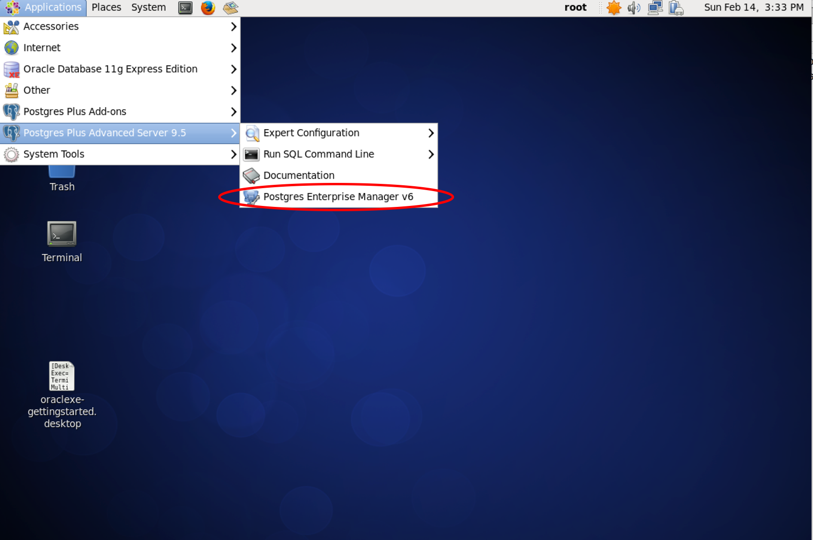

2. PEM Client

	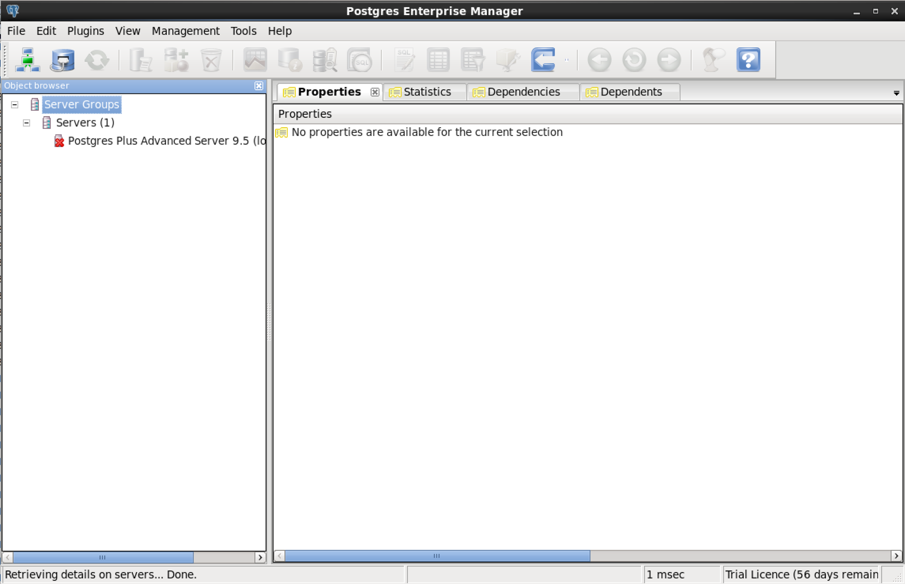

3. Connect to DB Server

	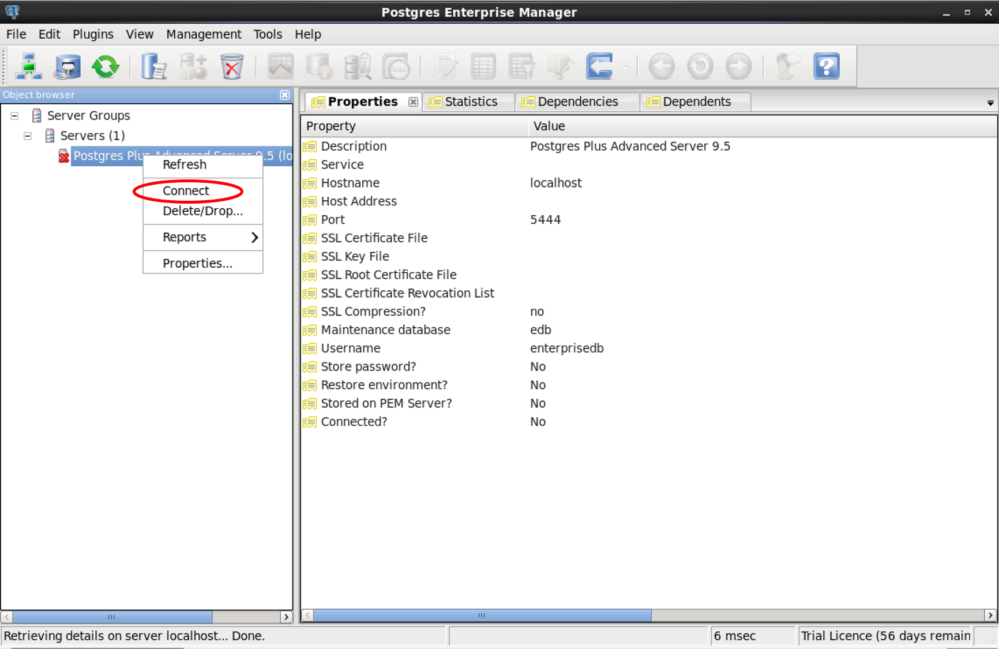

4. Enter Password

	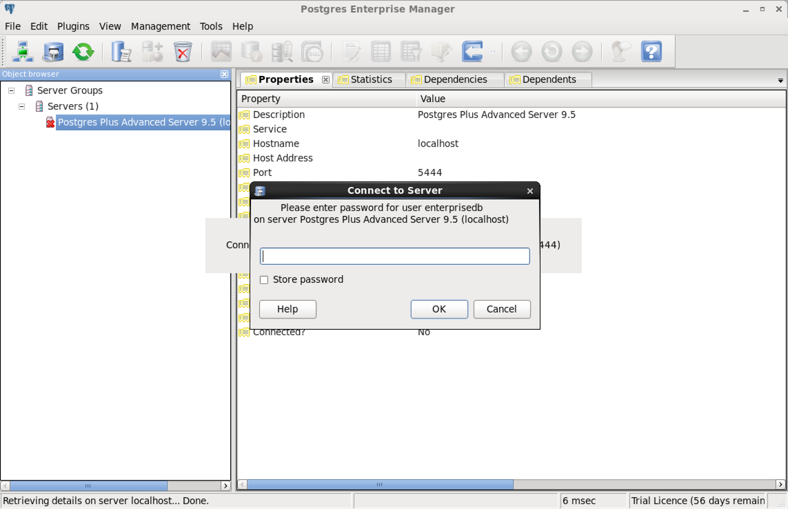

5. Connected DB Server

	

6. Navigate Databases

	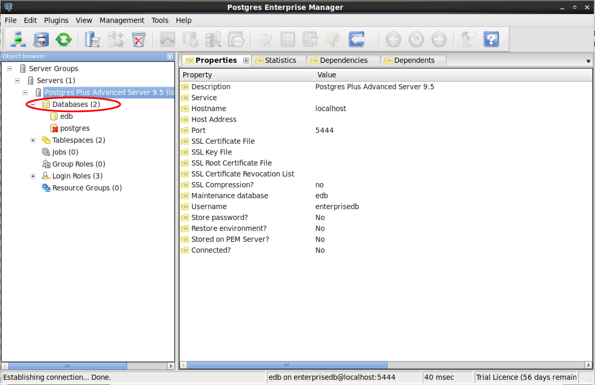

7. Navigate edb Database

	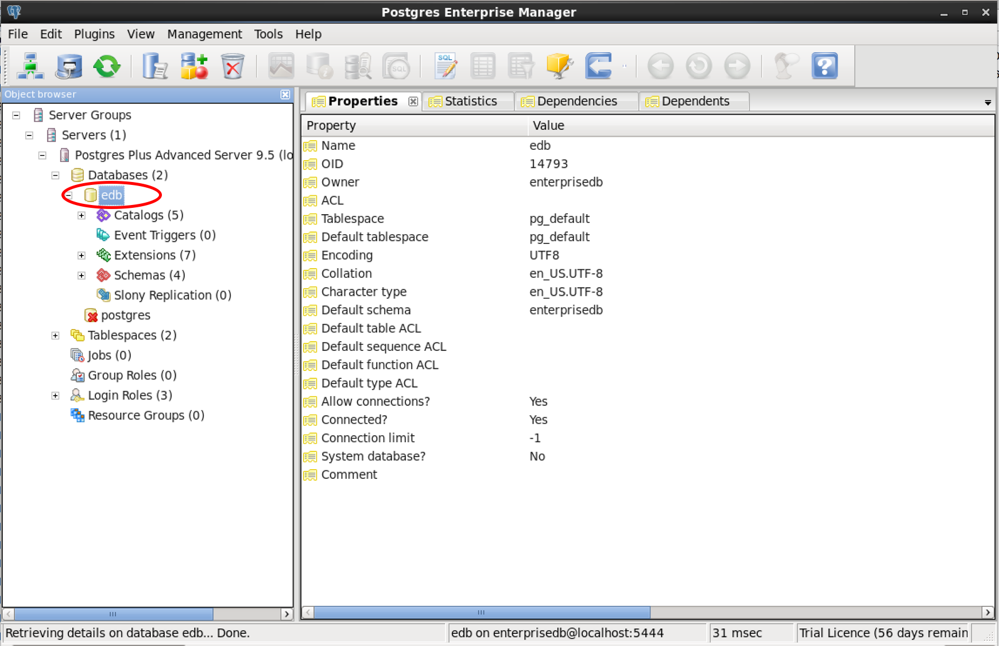

8. Navigate public Schema of edb Database

	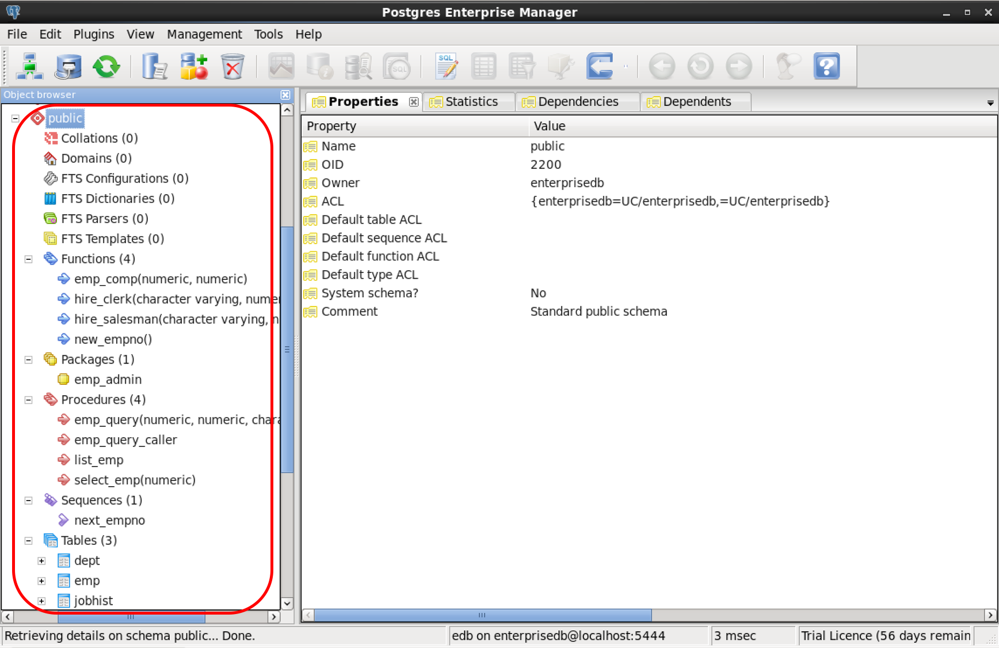

9. Execute Query Tool

  Menu > Tools > Query Tool 또는 Ctrl+E
	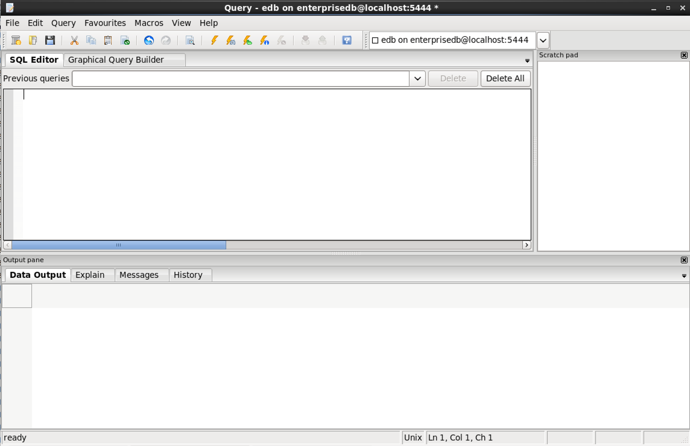

10. Execute Query & Query Result

	

11. Execute Query Plan & Graphical Query Plan

	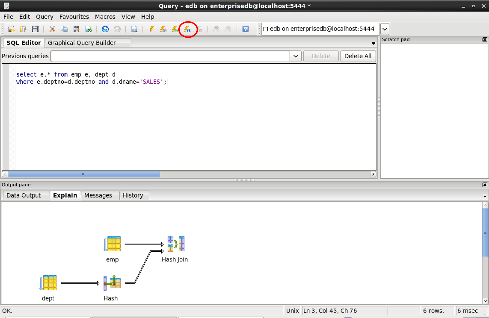

12. Execute Query Plan & Plain Text Query Plan

	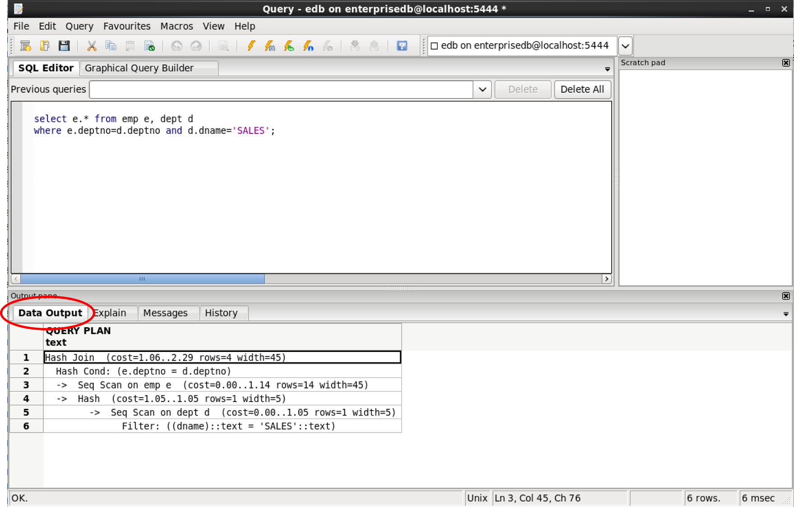

13. Connect to Other Database

	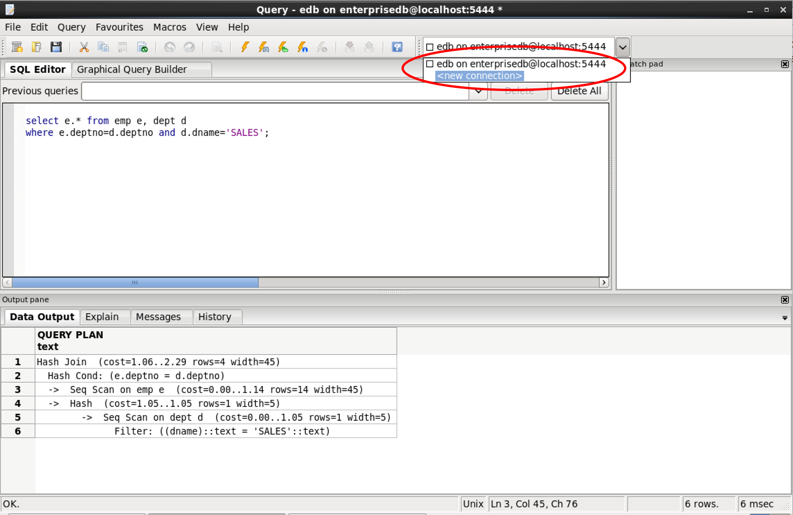

14. Enter Connection Information

	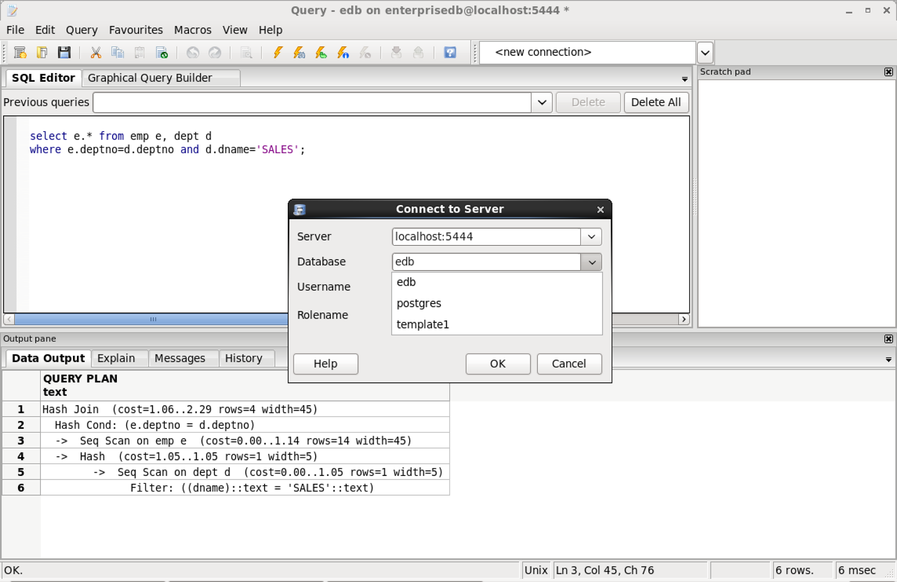

15. Enter Password

	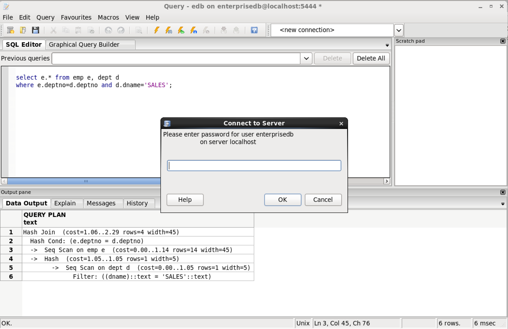

16. Connected to postgres Database

	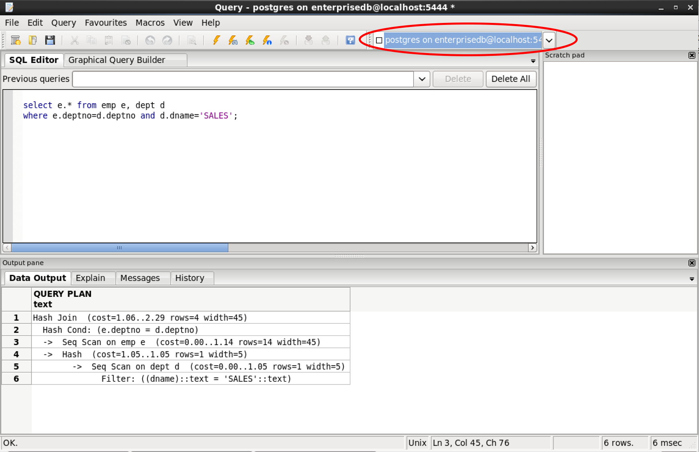

17. Check Connection Information

	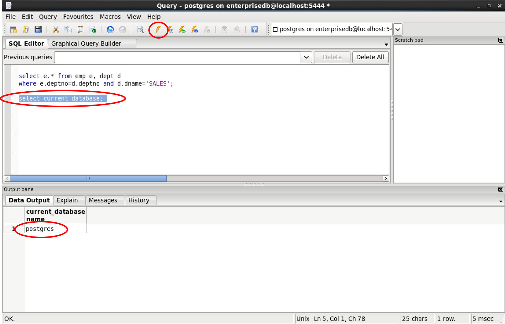
