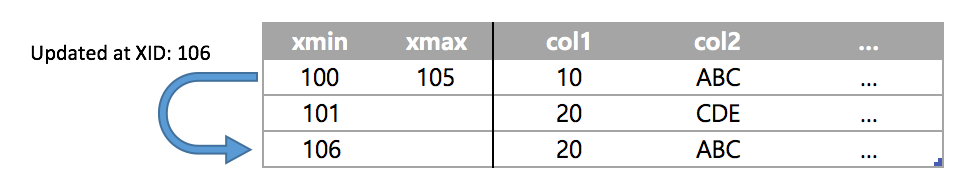

# Vacuum
## Vacuum 이란
### MVCC (Multi Version Concurrency Control)
MVCC는 여러 사용자가 조회와 동시에 변경이 가능하도록 하는 기능이므로 이를 구현하기 위해서는 DB내 어딘가에 데이터의 여러 버전이 저장되어 있어야 한다. 어떤 방식으로 버전들을 저장하고 조회할 것인지는 다양한 방식이 존제하고 각각의 장단점이 있다.

#### PostgreSQL의 MVCC 구현
PostgreSQL은 변경이 발생하면 기존 데이터는 그대로 두고 새로운 데이터를 하나 더 생성하는 전략을 사용한다. 새로운 데이터 역시 기존 데이터와 마찬가지로 __테이블 내부에__ 생성 되고 물리적으로 보면 테이블에 record가 2배로 늘어난 것과 동일하다.

아래 예를 보자



1. XID(transaction ID) 100에 첫번째 record가 insert
2. 101에 두번째 데이터가 insert 되었다.
3. XID 106이 첫번째 데이터의 col1을 20으로 update하였다.


만약 XID 100번이 아직 남아있다면 101번 데이터는 그 이후에 만들어 졌기 때문에 `(10, 'ABC')`인 데이터 1건만 보일 것이다. 또한

* XID 101번 transaction에게는 `(10, 'ABC'), (20, 'CDE')` 두건의 데이터가 보이게 된다.
* XID 106 이전의 transaction은 `(10, 'ABC'), (20, 'CDE')`를 보게 된다.
* 그 이후의 transaction은 `(20, 'CDE'), (20, 'ABC')`를 보게 된다.

이런 방식으로 MVCC를 구현하는 것이 PostgreSQL의 전략이다.

### Vacuum
이 방식은 UNDO와 같이 별도의 공간을 사용하지 않고 테이블을 같이 사용한다는 특징이 있다. 이로 인해 발생하는 여러가지 장단점이 있는데 가장 특징적인 점으로는 vacuum을 들 수 있다.

위와 같은 방식에서는 update와 delete에 의해 더이상은 필요없어진 데이터가 점점 늘어나게 됨으로, 이 데이터를 정리해 주는 작업이 vacuum이다.

아래의 테스트 케이스를 보자

```
edb=# create table test (col1 integer, col2 varchar(100));
CREATE TABLE
edb=# alter table test set (autovacuum_enabled = false);
ALTER TABLE
edb=# insert into test values (10, 'ABC');
INSERT 0 1
edb=# insert into test values (20, 'CDE');
INSERT 0 1
edb=# update test set col1 = 30 where col1 = 10;
UPDATE 1
edb=# update test set col2 = 'DEF' where col1 = 20;
UPDATE 1
edb=# select * from test;
 col1 | col2
------+------
   30 | ABC
   20 | DEF
(2 rows)

```

2건의 데이터가 들어있고 각각 1번씩 update가 되었다. 테스트를 위해 autovacuum은 disable 해 두었다. 이제 이 테이블에 vacuum을 해 보면 아래와 같다.

```
edb=# vacuum verbose test;
INFO:  vacuuming "public.test"
INFO:  "test": found 2 removable, 2 nonremovable row versions in 1 out of 1 pages
DETAIL:  0 dead row versions cannot be removed yet.
There were 0 unused item pointers.
Skipped 0 pages due to buffer pins.
0 pages are entirely empty.
CPU 0.00s/0.00u sec elapsed 0.00 sec.
VACUUM
```

2번째 줄을 보면 2건의 `removable`이 정리되고 2건의 `nonremovable`이 남았다는 것을 볼 수 있다.

vacuum은 removable tuple에 표시만 한다. 그 공간이 정리가 되어 없어지지는 않고 나중에 빈공간이 필요할 경우 이 공간을 사용하도록 해 준다. 빈 공간을 모두 제거하여 완전히 정리하고 싶다면 `vacuum` 대신 `vacuum full` 명령을 사용할 수 있다.

```
edb=# select pg_relation_filepath('test');
 pg_relation_filepath
----------------------
 base/14845/16387
(1 row)

edb=# vacuum full verbose test;
INFO:  vacuuming "public.test"
INFO:  "test": found 0 removable, 2 nonremovable row versions in 1 pages
DETAIL:  0 dead row versions cannot be removed yet.
CPU 0.00s/0.00u sec elapsed 0.00 sec.
VACUUM
edb=# select pg_relation_filepath('test');
 pg_relation_filepath
----------------------
 base/14845/16390
(1 row)

```

이 경우 table에 lock이 걸리고 모든 live tuple만 모아서 새로운 테이블을 만들고 기존 테이블을 drop한다. `pg_relation_filepath` 함수로 확인해 보면 테이블이 저장된 파일의 이름이 변경된 것을 볼 수 있다. Full vacuum은 성능에 미치는 영향이 크기 때문에 운영 환경에서는 조심해서 사용해야 한다.

#### Vacuum Freeze & Transaction ID Wrap-around
또 다른 아키택처적인 특직으로 `vacuum freeze`가 있다. 앞서 MVCC 구현이 각 tuple별 xmin, xmax 값을 이용 한다는 점을 설명했다. 이 두 값은 각각 32bit integer로 되어 있기 때문에 최대 40억 정도의 값을 가질 수 있는데 이 값들은 공간적인 오버헤드이기 때문에 크기를 제한한 것이다.

이 값과 modulo-2^32 연산을 이용하여 circular한 방식으로 TX들의 선후 관계가 관리 되는데 이때 현재 xid보다 큰 20억개는 미래, 작은 20억개는 과거가 된다.


위 상황에서 그대로 20억 건 이상의 tx가 진행되게 되면 어느 순간 아래와 같이 과거에 생성된 데이터와 미래의 영역이 겹치게 되는 상황이 발생할 수 있다.


이런 상황이 발생하게 되면 과거의 데이터로 조회가 되어야 하지만 조회가 되지 않는 상황이 발생하게 되어 데이터가 사라지게 된다. 그런데 20억이라는 값은 충분한 값일까? 문제는 그렇지 않다는 점이다. 실제 운영 환경에서 20억번의 transaction은 생각보다 금방 발생하며 부하가 높은 시스템의 경우 몇달 안에 20억번의 transaction이 발생될 수 있다.

XID가 20억을 넘어가게 되면 숫자가 초기화 되고 다시 처음부터 시작하게 되는데, 테이블에 아주 오래된 tuple들이 남아있다면 MVCC 메커니즘에 문제가 생긴다.

XID가 20억을 넘어서 다시 처음부터 시작했다고 가정하고 위의 예를 다시 생각해 보자. 아주 오래전이 만들어진 데이터들이 갑자기 미래의 데이터로 보이기 시작한다. 예제의 데이터 모두 (min 100, 101, 106) 현재 XID보다 크기 때문에 현재 transaction에게 보이면 안되는 데이터가 되어 버린다. 사용자 입장에서는 데이터가 갑자기 사라져 버리는 것이다.

이런 일이 벌어지면 안되기 때문에 MVCC 버전 처리가 더이상 필요 없는 데이터, 즉 오래된 데이터들의 xmin 값을 특수한 XID 값으로 정리해 주는 작업이 필요하다. 이미 20억번의 transaction이 발생하고 한바퀴를 돌아온 시점에서 예제의 데이터 들은 뭉뚱그려서 아주 오래전 부터 있었던 데이터라는 것 만 알면 되며, 지금 시점의 transaction들에게는 그냥 무조건 보여주면 되는 데이터가 된다는 의미이다. 이를 처리해 주는 작업이 바로 `vacuum freeze`이다.

`vacuum freeze`가 실행 되면 이런 데이터들의 xmin을 일괄적으로 `FrozenTransactionId`라는 특수한 xid로 변경하게 된다. 이 작업이 tuple freezing이고 이렇게 frozen된 데이터들은 더이상 위와 같은 문제 없이 모두에게 보이는 데이터로 처리되게 된다.


#### HEAP_XMIN_FROZEN tuple status bit (최근 버전 - 정확한 버전은 확인 필요)

예전에는 `vacuum freeze`시 xmin 값을 실제 `FrozenTransactionId`로 update했었으나 다양한 문제가 있어 방식이 변경 되었다. 각 tuple의 t_infomask에 `HEAP_XMIN_FROZEN` bit 만 변경하고 xmin 값은 유지된다.
`HEAP_XMIN_FROZEN`은 `HEAP_XMIN_COMMITTED`(0x0100)와 `HEAP_XMIN_INVALID`(0x0200)을 합한 값으로 0x0300이다.

##### 테스트

```
create table test (val timestamp) with (autovacuum_enabled = false);
insert into test values (now()); \watch 4
```

```
test=# select t_infomask::bit(16) & 256::bit(16), t_infomask::bit(16) & 512::bit(16)
  from heap_page_items(get_raw_page('test', 0)) order by age(t_xmin);
     ?column?     |     ?column?     
------------------+------------------
 0000000000000000 | 0000000000000000
 0000000000000000 | 0000000000000000
 0000000000000000 | 0000000000000000
 0000000000000000 | 0000000000000000
(4 rows)

test=# vacuum test;
VACUUM

test=# select t_infomask::bit(16) & 256::bit(16), t_infomask::bit(16) & 512::bit(16)
  from heap_page_items(get_raw_page('test', 0)) order by age(t_xmin);
     ?column?     |     ?column?     
------------------+------------------
 0000000000000000 | 0000000000000000
 0000000000000000 | 0000000000000000
 0000000000000000 | 0000000000000000
 0000000100000000 | 0000000000000000
 0000000100000000 | 0000000000000000
 0000000100000000 | 0000000000000000
 0000000100000000 | 0000000000000000
 0000000100000000 | 0000000000000000
 0000000100000000 | 0000000000000000
 0000000100000000 | 0000000000000000
 0000000100000000 | 0000000000000000
 0000000100000000 | 0000000000000000
 0000000100000000 | 0000000000000000
(13 rows)

test=# vacuum freeze test;
VACUUM
test=# select t_infomask::bit(16) & 256::bit(16), t_infomask::bit(16) & 512::bit(16)
  from heap_page_items(get_raw_page('test', 0)) order by age(t_xmin);
     ?column?     |     ?column?     
------------------+------------------
 0000000100000000 | 0000001000000000
 0000000100000000 | 0000001000000000
 0000000100000000 | 0000001000000000
 0000000100000000 | 0000001000000000
 0000000100000000 | 0000001000000000
 0000000100000000 | 0000001000000000
 0000000100000000 | 0000001000000000
 0000000100000000 | 0000001000000000
 0000000100000000 | 0000001000000000
 0000000100000000 | 0000001000000000
 0000000100000000 | 0000001000000000
 0000000100000000 | 0000001000000000
 0000000100000000 | 0000001000000000
 0000000100000000 | 0000001000000000
 0000000100000000 | 0000001000000000
 0000000100000000 | 0000001000000000
(16 rows)
```

당연히 종료되지 않은 transaction이 있어서 freezing될 수 없는 tuple이라면 0x0200 bit는 설정되지 않는다.

## Vacuum 설정

### Parameter 설명

#### autovacuum (boolean)
Controls whether the server should run the autovacuum launcher daemon. This is on by default; however, track_counts must also be enabled for autovacuum to work. This parameter can only be set in the postgresql.conf file or on the server command line; however, autovacuuming can be disabled for individual tables by changing table storage parameters.

Note that even when this parameter is disabled, the system will launch autovacuum processes if necessary to prevent transaction ID wraparound. See Section 23.1.5 for more information.

#### log_autovacuum_min_duration (integer)
Causes each action executed by autovacuum to be logged if it ran for at least the specified number of milliseconds. Setting this to zero logs all autovacuum actions. Minus-one (the default) disables logging autovacuum actions. For example, if you set this to 250ms then all automatic vacuums and analyzes that run 250ms or longer will be logged. In addition, when this parameter is set to any value other than -1, a message will be logged if an autovacuum action is skipped due to the existence of a conflicting lock. Enabling this parameter can be helpful in tracking autovacuum activity. This parameter can only be set in the postgresql.conf file or on the server command line; but the setting can be overridden for individual tables by changing table storage parameters.

#### autovacuum_max_workers (integer)
Specifies the maximum number of autovacuum processes (other than the autovacuum launcher) that may be running at any one time. The default is three. This parameter can only be set at server start.

#### autovacuum_naptime (integer)
Specifies the minimum delay between autovacuum runs on any given database. In each round the daemon examines the database and issues VACUUM and ANALYZE commands as needed for tables in that database. The delay is measured in seconds, and the default is one minute (1min). This parameter can only be set in the postgresql.conf file or on the server command line.

#### autovacuum_vacuum_threshold (integer)
Specifies the minimum number of updated or deleted tuples needed to trigger a VACUUM in any one table. The default is 50 tuples. This parameter can only be set in the postgresql.conf file or on the server command line; but the setting can be overridden for individual tables by changing table storage parameters.

#### autovacuum_analyze_threshold (integer)
Specifies the minimum number of inserted, updated or deleted tuples needed to trigger an ANALYZE in any one table. The default is 50 tuples. This parameter can only be set in the postgresql.conf file or on the server command line; but the setting can be overridden for individual tables by changing table storage parameters.

#### autovacuum_vacuum_scale_factor (floating point)
Specifies a fraction of the table size to add to autovacuum_vacuum_threshold when deciding whether to trigger a VACUUM. The default is 0.2 (20% of table size). This parameter can only be set in the postgresql.conf file or on the server command line; but the setting can be overridden for individual tables by changing table storage parameters.

#### autovacuum_analyze_scale_factor (floating point)
Specifies a fraction of the table size to add to autovacuum_analyze_threshold when deciding whether to trigger an ANALYZE. The default is 0.1 (10% of table size). This parameter can only be set in the postgresql.conf file or on the server command line; but the setting can be overridden for individual tables by changing table storage parameters.

#### autovacuum_freeze_max_age (integer)
Specifies the maximum age (in transactions) that a table's pg_class.relfrozenxid field can attain before a VACUUM operation is forced to prevent transaction ID wraparound within the table. Note that the system will launch autovacuum processes to prevent wraparound even when autovacuum is otherwise disabled.

Vacuum also allows removal of old files from the pg_clog subdirectory, which is why the default is a relatively low 200 million transactions. This parameter can only be set at server start, but the setting can be reduced for individual tables by changing table storage parameters. For more information see Section 23.1.5.

#### autovacuum_multixact_freeze_max_age (integer)
Specifies the maximum age (in multixacts) that a table's pg_class.relminmxid field can attain before a VACUUM operation is forced to prevent multixact ID wraparound within the table. Note that the system will launch autovacuum processes to prevent wraparound even when autovacuum is otherwise disabled.

Vacuuming multixacts also allows removal of old files from the pg_multixact/members and pg_multixact/offsets subdirectories, which is why the default is a relatively low 400 million multixacts. This parameter can only be set at server start, but the setting can be reduced for individual tables by changing table storage parameters. For more information see Section 23.1.5.1.

#### autovacuum_vacuum_cost_delay (integer)
Specifies the cost delay value that will be used in automatic VACUUM operations. If -1 is specified, the regular vacuum_cost_delay value will be used. The default value is 20 milliseconds. This parameter can only be set in the postgresql.conf file or on the server command line; but the setting can be overridden for individual tables by changing table storage parameters.

#### autovacuum_vacuum_cost_limit (integer)
Specifies the cost limit value that will be used in automatic VACUUM operations. If -1 is specified (which is the default), the regular vacuum_cost_limit value will be used. Note that the value is distributed proportionally among the running autovacuum workers, if there is more than one, so that the sum of the limits for each worker does not exceed the value of this variable. This parameter can only be set in the postgresql.conf file or on the server command line; but the setting can be overridden for individual tables by changing table storage parameters.

## 관리상 주의 점

### Long query

Long query가 수행 되면 해당 쿼리가 읽어야 하는 데이터들은 vacuum에 의해 정리가 될수 없다. PostgreSQL에서는 Snapshot too old 같은 에러가 없으므로 정리되지 못한 데이터가 계속 남아 있을 수 있다. 따라서 Zombie 세션 관리에 각별히 신경을 써야 한다.

```
edb=# begin work ISOLATION LEVEL REPEATABLE READ;         |
BEGIN                                                     |
                                                          |
                                                          |
                                                          | edb=# begin work ISOLATION LEVEL REPEATABLE READ;
                                                          | BEGIN
                                                          | edb=# update test set sal = sal * 1.2;
                                                          | UPDATE 17
                                                          | edb=# commit;
                                                          |
                                                          | edb=# vacuum verbose test;
                                                          | INFO:  vacuuming "enterprisedb.test"
                                                          | INFO:  "test": found 0 removable, 34 nonremovable row versions in 1 out of 1 pages
                                                          | DETAIL:  17 dead row versions cannot be removed yet.
                                                          | There were 0 unused item pointers.
                                                          | Skipped 0 pages due to buffer pins.
                                                          | 0 pages are entirely empty.
                                                          | CPU 0.00s/0.00u sec elapsed 0.00 sec.
                                                          | VACUUM                                                    
                                                          |
edb=# commit;                                             |
COMMIT                                                    |
                                                          |  
                                                          | edb=# vacuum verbose test;
                                                          | INFO:  vacuuming "enterprisedb.test"
                                                          | INFO:  "test": found 17 removable, 17 nonremovable row versions in 1 out of 1 pages
                                                          | DETAIL:  0 dead row versions cannot be removed yet.
                                                          | There were 17 unused item pointers.
                                                          | Skipped 0 pages due to buffer pins.
                                                          | 0 pages are entirely empty.
                                                          | CPU 0.00s/0.00u sec elapsed 0.00 sec.
                                                          | VACUUM
                                                          | edb=# vacuum verbose test;
                                                          | INFO:  vacuuming "enterprisedb.test"
                                                          | INFO:  "test": found 0 removable, 17 nonremovable row versions in 1 out of 1 pages
                                                          | DETAIL:  0 dead row versions cannot be removed yet.
                                                          | There were 17 unused item pointers.
                                                          | Skipped 0 pages due to buffer pins.
                                                          | 0 pages are entirely empty.
                                                          | CPU 0.00s/0.00u sec elapsed 0.00 sec.
                                                          | VACUUM

```
